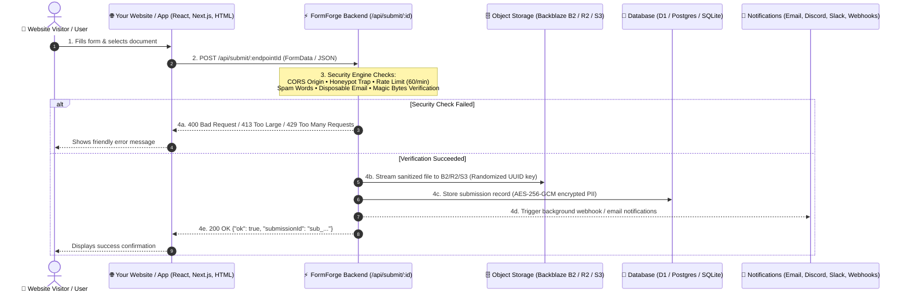

# 🛠️ FormForge v1.0.0 Universal — Ultimate Integration Guide
> **Universal Form Backend & Document Intake Engine for Any Website, App, or Framework**

This guide provides drop-in integration recipes for connecting **any website, web app, game, or CMS** to your FormForge backend.

---

## 🤖 Instructions for AI Coding Assistants (Cursor, ChatGPT, Claude, Copilot, v0, Antigravity)

If you are an AI assistant tasked with integrating FormForge into this codebase:
1. **Endpoint Resolution**:
   - Check if the environment variable `NEXT_PUBLIC_FORMFORGE_ENDPOINT` (Next.js), `VITE_FORMFORGE_ENDPOINT` (Vite), or `PUBLIC_FORMFORGE_ENDPOINT` (Astro/SvelteKit) exists in `.env.local` or `.env`.
   - If not set, define a placeholder `https://formforge.YOUR-DOMAIN.com/api/submit/YOUR_ENDPOINT_ID` and instruct the user to update it with their real endpoint from FormForge Dashboard.
2. **Bot Trap (Honeypot)**:
   - Always include a hidden honeypot field:
     ```html
     <input name="website" tabindex="-1" autocomplete="off" style="display:none;" />
     ```
   - Real users do not see or fill this field. Bots that fill it will have their submissions blocked automatically.
3. **File Attachments & Documents**:
   - When the form includes document/file uploads:
     - Always set `enctype="multipart/form-data"` on `<form>`.
     - In JavaScript/React/Vue/Svelte, always submit using `new FormData(formElement)`. **Do not** use `JSON.stringify()` for file uploads.
     - Add appropriate `accept` attribute (e.g. `accept=".pdf,.png,.jpg,.jpeg,.docx"`).
4. **Anti-Spam (ALTCHA Proof-of-Work)**:
   - If the user has ALTCHA enabled in FormForge settings, use the exact same endpoint URL for `<altcha-widget challengeurl="YOUR_ENDPOINT_URL"></altcha-widget>`. No extra API key or configuration is needed.

---

## ⚡ Quick Architecture Overview



---

## 🔐 Crucial Step: Set Allowed Origins (CORS)

If your website is hosted on `https://mycompany.com` and FormForge is on `https://formforge.mycompany.com`, the visitor’s browser will enforce CORS security.

1. Open your **FormForge Dashboard** (`/dashboard`).
2. Select your form and click the **Settings** tab.
3. Locate **Allowed Origins**:
   - **Local Development**: Enter `*` or `http://localhost:3000`.
   - **Production**: Enter your exact production URL(s), comma-separated: `https://mycompany.com, https://www.mycompany.com`.
4. Click **Save Settings**.

---

## 📦 Ready-to-Use Integration Recipes

### Recipe 1: Modern HTML5 Form with Document Upload & Honeypot
*Best for: Static websites, landing pages, Hugo, Jekyll, 11ty, WordPress custom HTML.*

```html
<!-- FormForge Universal HTML5 Contact & Document Upload Form -->
<form 
  method="POST" 
  action="https://YOUR-FORMFORGE-DOMAIN.com/api/submit/YOUR_ENDPOINT_ID"
  enctype="multipart/form-data"
  style="max-width: 480px; margin: 0 auto; display: flex; flex-direction: column; gap: 14px; font-family: sans-serif;"
>
  <div>
    <label style="display: block; font-weight: bold; margin-bottom: 4px;">Full Name</label>
    <input name="name" type="text" required placeholder="Jane Doe" style="width: 100%; padding: 10px; border-radius: 8px; border: 1px solid #ccc; box-sizing: border-box;" />
  </div>

  <div>
    <label style="display: block; font-weight: bold; margin-bottom: 4px;">Work Email</label>
    <input name="email" type="email" required placeholder="jane@company.com" style="width: 100%; padding: 10px; border-radius: 8px; border: 1px solid #ccc; box-sizing: border-box;" />
  </div>

  <div>
    <label style="display: block; font-weight: bold; margin-bottom: 4px;">Message</label>
    <textarea name="message" rows="4" required placeholder="How can we help?" style="width: 100%; padding: 10px; border-radius: 8px; border: 1px solid #ccc; box-sizing: border-box;"></textarea>
  </div>

  <!-- Document / Attachment Upload Field -->
  <div>
    <label style="display: block; font-weight: bold; margin-bottom: 4px;">Attach Document (PDF, DOCX, PNG, JPG)</label>
    <input name="attachment" type="file" accept=".pdf,.docx,.png,.jpg,.jpeg" style="width: 100%;" />
    <small style="color: #666;">Max size: 10MB. Files are verified with binary signature inspection.</small>
  </div>

  <!-- Anti-Bot Honeypot Trap (Invisible to humans, traps spambots) -->
  <input name="website" tabindex="-1" autocomplete="off" style="display: none;" />

  <button type="submit" style="padding: 12px 20px; background: #0284c7; color: white; border: none; border-radius: 8px; font-weight: bold; cursor: pointer;">
    Send Message ➔
  </button>
</form>
```

---

### Recipe 2: HTML5 Form with Built-in ALTCHA Proof-of-Work (Anti-Spam)
*100% Free, GDPR-Compliant, No Google reCAPTCHA, No Cloudflare Turnstile token hassle.*

```html
<!-- 1. Include the lightweight ALTCHA WebComponent script in <head> -->
<script defer src="https://cdn.jsdelivr.net/npm/altcha/dist/altcha.min.js" type="module"></script>

<!-- 2. Form element -->
<form 
  method="POST" 
  action="https://YOUR-FORMFORGE-DOMAIN.com/api/submit/YOUR_ENDPOINT_ID"
  enctype="multipart/form-data"
>
  <input name="name" type="text" required placeholder="Your Name" />
  <input name="email" type="email" required placeholder="your@email.com" />
  <textarea name="message" required placeholder="Your Message"></textarea>

  <!-- Honeypot Bot Trap -->
  <input name="website" tabindex="-1" autocomplete="off" style="display:none;" />

  <!-- 3. ALTCHA Proof-of-Work Widget: Point challengeurl to the EXACT same FormForge endpoint URL! -->
  <altcha-widget challengeurl="https://YOUR-FORMFORGE-DOMAIN.com/api/submit/YOUR_ENDPOINT_ID"></altcha-widget>

  <button type="submit">Submit Form</button>
</form>
```

---

### Recipe 3: React / Vite / Next.js Client Component (TypeScript + Tailwind CSS)
*Best for: Modern React, Next.js (App Router `"use client"`), Vite, Remix, Create-React-App.*

```tsx
"use client";

import React, { useState } from "react";

// In production, set this in .env.local:
// NEXT_PUBLIC_FORMFORGE_ENDPOINT="https://formforge.YOUR-DOMAIN.com/api/submit/YOUR_ENDPOINT_ID"
const ENDPOINT_URL = process.env.NEXT_PUBLIC_FORMFORGE_ENDPOINT || "https://YOUR-FORMFORGE-DOMAIN.com/api/submit/YOUR_ENDPOINT_ID";

export default function ContactForm() {
  const [submitting, setSubmitting] = useState(false);
  const [success, setSuccess] = useState(false);
  const [errorMsg, setErrorMsg] = useState<string | null>(null);

  const handleSubmit = async (e: React.FormEvent<HTMLFormElement>) => {
    e.preventDefault();
    setSubmitting(true);
    setErrorMsg(null);

    const formData = new FormData(e.currentTarget);

    try {
      const res = await fetch(ENDPOINT_URL, {
        method: "POST",
        body: formData, // FormData automatically sets multipart/form-data boundary
      });

      const data = await res.json();
      if (!res.ok || !data.ok) {
        throw new Error(data.message || "Failed to submit form.");
      }

      setSuccess(true);
      (e.target as HTMLFormElement).reset();
    } catch (err: any) {
      setErrorMsg(err.message || "An unexpected error occurred. Please try again.");
    } finally {
      setSubmitting(false);
    }
  };

  if (success) {
    return (
      <div className="rounded-2xl border border-emerald-500/30 bg-emerald-500/10 p-6 text-center text-emerald-300">
        <h3 className="text-lg font-bold">✓ Thank you!</h3>
        <p className="text-sm mt-1">Your message and documents have been securely received.</p>
        <button
          onClick={() => setSuccess(false)}
          className="mt-4 text-xs font-semibold underline hover:text-emerald-200"
        >
          Send another submission
        </button>
      </div>
    );
  }

  return (
    <form onSubmit={handleSubmit} className="space-y-4 max-w-lg mx-auto bg-slate-900/80 p-6 rounded-2xl border border-slate-800 text-white">
      <div>
        <label className="block text-xs font-semibold text-slate-300 uppercase tracking-wider mb-1">Full Name</label>
        <input name="name" type="text" required placeholder="Alex Johnson" className="w-full rounded-xl bg-slate-950 border border-slate-700 p-2.5 text-sm focus:border-cyan-500 focus:outline-none" />
      </div>

      <div>
        <label className="block text-xs font-semibold text-slate-300 uppercase tracking-wider mb-1">Email Address</label>
        <input name="email" type="email" required placeholder="alex@company.com" className="w-full rounded-xl bg-slate-950 border border-slate-700 p-2.5 text-sm focus:border-cyan-500 focus:outline-none" />
      </div>

      <div>
        <label className="block text-xs font-semibold text-slate-300 uppercase tracking-wider mb-1">Message</label>
        <textarea name="message" rows={3} required placeholder="Tell us about your inquiry..." className="w-full rounded-xl bg-slate-950 border border-slate-700 p-2.5 text-sm focus:border-cyan-500 focus:outline-none" />
      </div>

      {/* File Upload Dropzone */}
      <div>
        <label className="block text-xs font-semibold text-slate-300 uppercase tracking-wider mb-1">Document Attachment</label>
        <input name="attachment" type="file" accept=".pdf,.png,.jpg,.jpeg,.docx" className="w-full text-xs text-slate-400 file:mr-3 file:py-2 file:px-4 file:rounded-xl file:border-0 file:text-xs file:font-semibold file:bg-cyan-500/10 file:text-cyan-300 hover:file:bg-cyan-500/20 cursor-pointer" />
        <span className="text-[11px] text-slate-500 block mt-1">PDF, Word, or image up to 10MB</span>
      </div>

      {/* Honeypot Bot Trap */}
      <input name="website" tabIndex={-1} autoComplete="off" style={{ display: "none" }} />

      {errorMsg && (
        <div className="rounded-xl border border-rose-500/30 bg-rose-500/10 p-3 text-xs text-rose-300 font-medium">
          {errorMsg}
        </div>
      )}

      <button
        type="submit"
        disabled={submitting}
        className="w-full rounded-xl bg-gradient-to-r from-cyan-500 to-blue-600 py-3 font-bold text-white shadow-lg shadow-cyan-500/20 hover:from-cyan-400 hover:to-blue-500 disabled:opacity-60 transition"
      >
        {submitting ? "Submitting..." : "Send Secure Message ➔"}
      </button>
    </form>
  );
}
```

---

### Recipe 4: Vue 3 / Nuxt 3 Component (`<script setup>`)
*Best for: Vue 3, Nuxt 3, Vite-Vue.*

```vue
<script setup>
import { ref } from "vue";

const ENDPOINT_URL = "https://YOUR-FORMFORGE-DOMAIN.com/api/submit/YOUR_ENDPOINT_ID";

const submitting = ref(false);
const success = ref(false);
const errorMsg = ref("");

async function handleSubmit(event) {
  submitting.value = true;
  errorMsg.value = "";

  const formData = new FormData(event.target);

  try {
    const res = await fetch(ENDPOINT_URL, {
      method: "POST",
      body: formData,
    });
    const data = await res.json();
    if (!res.ok || !data.ok) throw new Error(data.message || "Submission failed");
    success.value = true;
    event.target.reset();
  } catch (err) {
    errorMsg.value = err.message || "Failed to submit.";
  } finally {
    submitting.value = false;
  }
}
</script>

<template>
  <form @submit.prevent="handleSubmit" class="contact-form">
    <input name="name" type="text" required placeholder="Your Name" />
    <input name="email" type="email" required placeholder="Your Email" />
    <textarea name="message" required placeholder="Your Message"></textarea>
    <input name="attachment" type="file" accept=".pdf,.png,.jpg,.jpeg" />
    
    <!-- Honeypot -->
    <input name="website" tabindex="-1" autocomplete="off" style="display:none;" />

    <p v-if="errorMsg" style="color: #f43f5e;">{{ errorMsg }}</p>
    <p v-if="success" style="color: #10b981;">✓ Form submitted successfully!</p>

    <button type="submit" :disabled="submitting">
      {{ submitting ? "Sending..." : "Submit" }}
    </button>
  </form>
</template>
```

---

### Recipe 5: Drop-in 1-Line Floating Widget (`widget.js`)
*Best for: WordPress, Shopify, Webflow, Squarespace, Ghost, Wix.*

Paste this code right before `</body>` in your website theme:

```html
<!-- FormForge Floating Feedback & Contact Widget -->
<script
  src="https://YOUR-FORMFORGE-DOMAIN.com/widget.js"
  data-endpoint="https://YOUR-FORMFORGE-DOMAIN.com/api/submit/YOUR_ENDPOINT_ID"
  data-position="bottom-right"
  data-color="#0284c7"
  data-title="Contact Us"
  data-btn-text="Feedback"
  defer
></script>
```

---

### Recipe 6: Zero-Code Hosted Public Form Page (`/f/[slug]`)
Every FormForge form includes a standalone, beautifully-designed public hosted URL:
* **Hosted Link**: `https://YOUR-FORMFORGE-DOMAIN.com/f/YOUR_FORM_SLUG`
* **Embed via iframe**:
  ```html
  <iframe 
    src="https://YOUR-FORMFORGE-DOMAIN.com/f/YOUR_FORM_SLUG" 
    width="100%" 
    height="650px" 
    frameborder="0"
    style="border: none; border-radius: 16px;"
  ></iframe>
  ```

---

### Recipe 7: Python / Node.js Backend API Request (cURL & scripts)

#### cURL (with document upload):
```bash
curl -X POST "https://YOUR-FORMFORGE-DOMAIN.com/api/submit/YOUR_ENDPOINT_ID" \
  -F "name=Jane Doe" \
  -F "email=jane@company.com" \
  -F "message=Attached report" \
  -F "attachment=@/path/to/report.pdf"
```

#### Python (`requests`):
```python
import requests

url = "https://YOUR-FORMFORGE-DOMAIN.com/api/submit/YOUR_ENDPOINT_ID"
data = {
    "name": "Jane Doe",
    "email": "jane@company.com",
    "message": "Attached report",
}
files = {
    "attachment": open("report.pdf", "rb")
}

response = requests.post(url, data=data, files=files)
print(response.json())
```

---

## 🛡️ Built-in Security Defenses

| Protection | How FormForge Enforces It |
| :--- | :--- |
| **Magic Bytes Inspection** | Verifies true binary signatures (%PDF, PNG, JPG). Bypasses/disguised executables (MZ, ELF, shell scripts) are blocked before upload. |
| **Honeypot Trap** | Submissions with the hidden bot trap field filled are rejected immediately with spam score 100. |
| **Rate Limiting** | 60 submissions/min per IP with HTTP 429 and `Retry-After` headers. |
| **Disposable Email Defense** | Automatically blocks 100+ temporary email providers (Mailinator, GuerrillaMail, etc.). |
| **At-Rest Encryption** | PII fields and submitter records encrypted with AES-256-GCM. |
| **Zero Server Code Execution** | Attachments stream directly to Backblaze B2, Cloudflare R2, or AWS S3. No local execution is possible. |

---

## ❓ Frequently Encountered Integration Errors & Fixes

### 1. CORS Error: `Response to preflight request doesn't pass access control check`
* **Cause**: Your website origin is not in the form’s allowed origins list.
* **Fix**: Go to FormForge Dashboard → Select Form → **Settings** → In **Allowed Origins**, add your website URL (e.g. `https://yourwebsite.com` or `*` for testing) and save.

### 2. File Upload Error: `Upload exceeds attachment limit` or `File type not allowed`
* **Cause**: The file exceeds `maxAttachmentSizeMb` (default 10MB) or its extension is not in `allowedFileExtensions`.
* **Fix**: Adjust attachment limits in FormForge Settings or ensure the file extension matches the whitelist.

### 3. Submission Limit Exceeded (`403 LIMIT_REACHED`)
* **Cause**: The form has a submission quota configured and has reached its cap.
* **Fix**: Increase the Submission Limit under Form Settings or clear test submissions.

---

> **FormForge v1.0.0 Universal** — Zero-Card Self-Hosted Form Engine  
> © 2024-2026 Sudhir Singh. All rights reserved.
