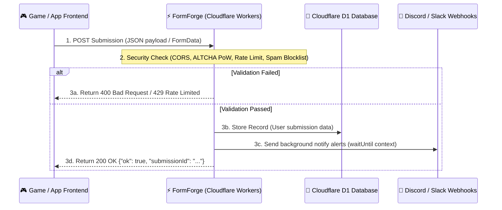

# 🛠️ FormForge - Custom App & Game Integration Guide

This guide explains how to connect custom applications, static web games, or headless frontend frameworks to your FormForge backend.

---

## 🔄 How it Works (Architecture Flow)

Below is the dynamic execution flow showing how your frontend game/app interacts with FormForge:



---

## 🌍 1. Crucial Pre-requisite: CORS (Cross-Origin Resource Sharing)

If your app or game is hosted on a domain like `https://my-game.pages.dev` and your FormForge backend is on `https://formforge.YOUR-SUBDOMAIN.workers.dev`, **browsers will block the request** unless you allow CORS.

### 🛠️ How to Enable CORS for Your App:
1. Log in to your **FormForge Dashboard** (`/dashboard`).
2. Select your form and click the **Settings** tab.
3. Locate the **Allowed Origins** field:
   * **To Allow Everything (Development):** Set it to `*`.
   * **To Secure in Production:** Set it to your exact domain, e.g., `https://my-game.pages.dev`.
4. Click **Save Settings**.

---

## 💻 2. Integration Snippets

### Option A: Modern JavaScript `fetch` (Best for games & dynamic scripts)
Use this within your game or app logic (e.g., when a player wins, loses, or finishes a round) to store game statistics.

```javascript
// Function to upload game results to FormForge
async function saveGameResult(playerName, score, role, roundsPlayed) {
  const url = "https://YOUR-WORKER.workers.dev/api/submit/YOUR_ENDPOINT_ID";
  
  const payload = {
    player_name: playerName,
    final_score: score,
    assigned_role: role,
    rounds: roundsPlayed,
    submitted_via: "Web Game v1.0"
  };

  try {
    const response = await fetch(url, {
      method: "POST",
      headers: {
        "Content-Type": "application/json"
      },
      body: JSON.stringify(payload)
    });

    const data = await response.json();
    if (response.ok && data.ok) {
      console.log("🎉 Stats stored! Submission ID:", data.submissionId);
    } else {
      console.error("❌ Submission rejected by FormForge:", data.message);
    }
  } catch (error) {
    console.error("🌐 Network/CORS Error:", error);
  }
}
```

### Option B: HTML5 Multipart Form (Best for Contact/File uploads)
Use this if you are collecting user feedback, bug reports, or attachments (such as screenshots) from your game.

```html
<form 
  method="POST" 
  action="https://YOUR-WORKER.workers.dev/api/submit/YOUR_ENDPOINT_ID"
  enctype="multipart/form-data"
  style="font-family: sans-serif; max-width: 400px; display: flex; flex-direction: column; gap: 12px;"
>
  <label>Your Name</label>
  <input name="name" type="text" required placeholder="Enter name" />

  <label>Email Address</label>
  <input name="email" type="email" required placeholder="name@domain.com" />

  <label>Game Bug Screenshot / Log File</label>
  <!-- NOTE: File input requires enctype="multipart/form-data" on the <form> element -->
  <input name="screenshot" type="file" required />

  <!-- Honeypot field (hidden from users, traps automated bots) -->
  <input name="website" tabindex="-1" autocomplete="off" style="display:none;" />

  <button type="submit">Submit Report</button>
</form>
```

### Option C: Single-Endpoint HTML Form with ALTCHA Anti-Spam (100% Free & Self-Hosted)
Use this when you have enabled **ALTCHA Proof-of-Work** in your FormForge dashboard settings. Both the cryptographic challenge (`GET`) and the form submission (`POST`) use the exact same endpoint URL!

```html
<!-- 1. Include the lightweight ALTCHA script in your <head> -->
<script defer src="https://cdn.jsdelivr.net/npm/altcha/dist/altcha.min.js" type="module"></script>

<!-- 2. Form submission -->
<form 
  method="POST" 
  action="https://YOUR-WORKER.workers.dev/api/submit/YOUR_ENDPOINT_ID"
  style="max-width: 400px; display: flex; flex-direction: column; gap: 12px; font-family: sans-serif;"
>
  <label>Your Name</label>
  <input name="name" type="text" required placeholder="Enter name" />

  <label>Email Address</label>
  <input name="email" type="email" required placeholder="name@domain.com" />

  <label>Message</label>
  <textarea name="message" required placeholder="Type your message"></textarea>

  <!-- Honeypot anti-bot field (keep hidden) -->
  <input name="website" tabindex="-1" autocomplete="off" style="display:none;" />

  <!-- 3. ALTCHA PoW Widget: Uses the EXACT same FormForge endpoint URL! -->
  <altcha-widget 
    challengeurl="https://YOUR-WORKER.workers.dev/api/submit/YOUR_ENDPOINT_ID"
  ></altcha-widget>

  <button type="submit">Submit Form</button>
</form>
```

### Option D: React / Next.js Component (`fetch` with JSON & State)
```tsx
"use client";

import { useState } from "react";

const ENDPOINT_URL = "https://YOUR-WORKER.workers.dev/api/submit/YOUR_ENDPOINT_ID";

export default function ContactForm() {
  const [formData, setFormData] = useState({ name: "", email: "", message: "", website: "" });
  const [status, setStatus] = useState<"idle" | "submitting" | "success" | "error">("idle");
  const [errorMsg, setErrorMsg] = useState("");

  const handleSubmit = async (e: React.FormEvent) => {
    e.preventDefault();
    setStatus("submitting");
    setErrorMsg("");

    try {
      const res = await fetch(ENDPOINT_URL, {
        method: "POST",
        headers: { "Content-Type": "application/json" },
        body: JSON.stringify(formData),
      });

      const data = await res.json();
      if (!res.ok || !data.ok) throw new Error(data.message || "Submission failed");

      setStatus("success");
      setFormData({ name: "", email: "", message: "", website: "" });
    } catch (err: any) {
      setStatus("error");
      setErrorMsg(err.message || "Failed to submit.");
    }
  };

  return (
    <form onSubmit={handleSubmit}>
      <input type="text" name="website" value={formData.website} onChange={e => setFormData({...formData, website: e.target.value})} style={{ display: "none" }} tabIndex={-1} autoComplete="off" />
      <input type="text" placeholder="Name" value={formData.name} onChange={e => setFormData({...formData, name: e.target.value})} required />
      <input type="email" placeholder="Email" value={formData.email} onChange={e => setFormData({...formData, email: e.target.value})} required />
      <textarea placeholder="Message" value={formData.message} onChange={e => setFormData({...formData, message: e.target.value})} required />
      <button type="submit" disabled={status === "submitting"}>
        {status === "submitting" ? "Sending..." : "Submit"}
      </button>
      {status === "success" && <p>✓ Message sent successfully!</p>}
      {status === "error" && <p>✕ {errorMsg}</p>}
    </form>
  );
}
```

---

## ⚠️ 3. Troubleshooting Integration Failures

### 1. `Response to preflight request doesn't pass access control check`
* **Fix:** The Origin header of your request doesn't match the `Allowed Origins` in your Form settings. Go to FormForge settings and add your frontend origin (e.g. `https://my-game.pages.dev`) to the allowed origins list.

### 2. Form submits, but fields are empty in the Dashboard
* **Fix:** If sending raw JSON, ensure headers have `"Content-Type": "application/json"`. If sending HTML form, make sure all inputs have unique `name="..."` tags.

### 3. Verification Link displays raw HTML instead of CSS styling
* **Fix:** The mail client is loading text fallback. FormForge v1.2.0 uses inline-table layouts optimized for all clients. Update to v1.2.0.

---

> **FormForge** — Developed by [Sudhir Singh](https://github.com/SudhirDevOps1)  
> © 2024-2026 Sudhir Singh. All rights reserved.
