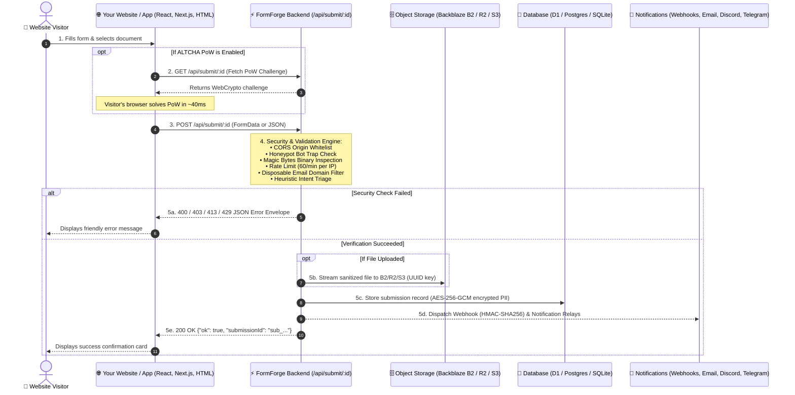

# 🛠️ FormForge v1.0.0 Universal — Ultimate Integration Guide & AI Implementation Prompt
> **Universal Form Backend & Document Intake Engine for Any Website, Web App, CMS, or Platform**  
> **Author & Maintainer**: [Sudhir Singh](https://github.com/SudhirDevOps1) | **License**: MIT Open Source

---

## 🤖 AI Assistant One-Shot Prompt (Cursor, ChatGPT, Claude, Copilot, Windsurf, v0, Antigravity)

> **FOR USERS:** Copy and paste the prompt box below directly into your AI coding tool (Cursor, ChatGPT, Claude, GitHub Copilot, v0, etc.) along with this file or your endpoint URL. The AI will automatically integrate FormForge into your project without asking extra questions!

```text
You are an expert fullstack software engineer. Your task is to integrate FormForge form handling into this project using the guidelines, security best practices, and code patterns provided in FormForge's INTEGRATION_GUIDE.md.

Here is what you must do:
1. Detect the project framework (Next.js App/Pages router, Vite + React, Vue 3 / Nuxt, Svelte / SvelteKit, Astro, or plain HTML).
2. Locate the existing contact/feedback/lead form or create a new responsive component.
3. Configure the endpoint via environment variables:
   - Next.js: process.env.NEXT_PUBLIC_FORMFORGE_ENDPOINT
   - Vite: import.meta.env.VITE_FORMFORGE_ENDPOINT
   - Nuxt: useRuntimeConfig().public.formforgeEndpoint
   - SvelteKit / Astro: PUBLIC_FORMFORGE_ENDPOINT
   - Fallback: Use the endpoint URL provided by the user.
4. Security & Anti-Spam Requirements:
   - Always include the invisible Honeypot bot trap field:
     <input type="text" name="website" tabIndex="-1" autoComplete="off" style="display:none" aria-hidden="true" />
   - If ALTCHA is enabled, include the ALTCHA WebComponent widget pointing challengeurl to the EXACT same FormForge endpoint URL.
   - For file/document uploads: ALWAYS use `new FormData(form)` and `enctype="multipart/form-data"`. DO NOT use JSON.stringify() when files are present.
5. User Experience:
   - Provide clear loading states (disable submit button, show "Sending...").
   - Display a clean success confirmation card with an option to send another message.
   - Display clear error alerts if the request fails.
   - Remind the user to add their site domain to "Allowed Origins (CORS)" in FormForge Dashboard -> Form Settings.
```

---

## ⚙️ Real Environment Configuration (What to Fill In)

When you deploy your site to production, you only need to customize these parameters:

| Configuration Variable | Real Environment Value | Where to Find in FormForge | Description |
| :--- | :--- | :--- | :--- |
| `FORMFORGE_ENDPOINT_URL` | `https://formforge.YOUR-DOMAIN.com/api/submit/YOUR_ENDPOINT_ID` | Form Dashboard ➔ **Connect & Snippets** | The unified URL that receives submissions (`POST`) and generates ALTCHA challenges (`GET`). |
| `FORMFORGE_ALLOWED_ORIGINS` | `https://yourwebsite.com, https://www.yourwebsite.com` | Form Dashboard ➔ **Settings ➔ Allowed Origins** | Whitelist your website's exact origin(s). Set to `*` only for local testing. |
| `FORMFORGE_ALTCHA_ENABLED` | `true` or `false` | Form Dashboard ➔ **Settings ➔ ALTCHA Anti-Spam** | Toggle on for 100% free, cookie-less, GDPR-compliant proof-of-work spam protection. |
| `FORMFORGE_HOSTED_URL` | `https://formforge.YOUR-DOMAIN.com/f/YOUR_SLUG` | Form Dashboard ➔ **Settings ➔ Public Form Slug** | Standalone hosted public form or iframe embed target. |
| `WEBHOOK_HMAC_SECRET` | Secret key string | Form Dashboard ➔ **Connect ➔ Delivery Logs** | Used to verify incoming webhook signatures (`X-FormForge-Signature`). |

### Framework Environment Variable Setup

Add the endpoint URL to your local environment file:

```bash
# Next.js (.env.local)
NEXT_PUBLIC_FORMFORGE_ENDPOINT="https://formforge.YOUR-DOMAIN.com/api/submit/YOUR_ENDPOINT_ID"

# Vite / React (.env)
VITE_FORMFORGE_ENDPOINT="https://formforge.YOUR-DOMAIN.com/api/submit/YOUR_ENDPOINT_ID"

# Nuxt 3 (.env)
NUXT_PUBLIC_FORMFORGE_ENDPOINT="https://formforge.YOUR-DOMAIN.com/api/submit/YOUR_ENDPOINT_ID"

# Astro & SvelteKit (.env)
PUBLIC_FORMFORGE_ENDPOINT="https://formforge.YOUR-DOMAIN.com/api/submit/YOUR_ENDPOINT_ID"
```

---

## ⚡ Architecture Flow



---

## 📦 Production Integration Recipes

---

### Recipe 1: Pure HTML5 Form (No-JS, Native Redirection & Honeypot)
*Best for: Static sites, landing pages, Hugo, Jekyll, 11ty, GitHub Pages, or simple HTML.*

```html
<!-- FormForge Universal HTML5 Contact Form -->
<form 
  action="https://formforge.YOUR-DOMAIN.com/api/submit/YOUR_ENDPOINT_ID" 
  method="POST"
  enctype="multipart/form-data"
  style="max-width: 500px; margin: 0 auto; display: flex; flex-direction: column; gap: 14px; font-family: -apple-system, BlinkMacSystemFont, 'Segoe UI', Roboto, sans-serif;"
>
  <!-- Optional Redirect: URL to redirect the user to upon success -->
  <input type="hidden" name="_next" value="https://yourwebsite.com/thank-you.html" />

  <!-- Anti-Bot Honeypot Trap (Invisible to humans, catches spam bots) -->
  <input type="text" name="website" style="display:none;" tabindex="-1" autocomplete="off" aria-hidden="true" />

  <div>
    <label style="display: block; font-weight: 600; font-size: 14px; margin-bottom: 4px;">Full Name</label>
    <input name="name" type="text" required placeholder="Jane Doe" style="width: 100%; padding: 10px 12px; border-radius: 8px; border: 1px solid #ccc; box-sizing: border-box;" />
  </div>

  <div>
    <label style="display: block; font-weight: 600; font-size: 14px; margin-bottom: 4px;">Email Address</label>
    <input name="email" type="email" required placeholder="jane@company.com" style="width: 100%; padding: 10px 12px; border-radius: 8px; border: 1px solid #ccc; box-sizing: border-box;" />
  </div>

  <div>
    <label style="display: block; font-weight: 600; font-size: 14px; margin-bottom: 4px;">Message</label>
    <textarea name="message" rows="4" required placeholder="How can we help?" style="width: 100%; padding: 10px 12px; border-radius: 8px; border: 1px solid #ccc; box-sizing: border-box;"></textarea>
  </div>

  <!-- Document / File Attachment (Optional) -->
  <div>
    <label style="display: block; font-weight: 600; font-size: 14px; margin-bottom: 4px;">Attachment (PDF, PNG, JPG, DOCX)</label>
    <input name="attachment" type="file" accept=".pdf,.png,.jpg,.jpeg,.docx" style="width: 100%; font-size: 13px;" />
    <small style="color: #666; font-size: 12px;">Max 10MB. Files undergo binary signature verification.</small>
  </div>

  <button type="submit" style="padding: 12px 20px; background: #0284c7; color: white; border: none; border-radius: 8px; font-weight: 600; font-size: 15px; cursor: pointer;">
    Send Message ➔
  </button>
</form>
```

---

### Recipe 2: HTML5 Form with ALTCHA Anti-Spam (100% Free & Self-Hosted)
*Best for: Zero tracking cookies, GDPR/CCPA compliant forms without Google reCAPTCHA or Cloudflare Turnstile.*

```html
<!DOCTYPE html>
<html lang="en">
<head>
  <meta charset="UTF-8">
  <title>Contact Us</title>
  <!-- 1. Load the lightweight ALTCHA WebComponent (<15KB) -->
  <script defer src="https://cdn.jsdelivr.net/npm/altcha/dist/altcha.min.js" type="module"></script>
</head>
<body>

  <form 
    action="https://formforge.YOUR-DOMAIN.com/api/submit/YOUR_ENDPOINT_ID" 
    method="POST"
    enctype="multipart/form-data"
    style="max-width: 480px; margin: 40px auto; display: flex; flex-direction: column; gap: 14px; font-family: sans-serif;"
  >
    <input type="hidden" name="_next" value="https://yourwebsite.com/thank-you" />
    <input type="text" name="website" style="display:none;" tabindex="-1" autocomplete="off" aria-hidden="true" />

    <input name="name" type="text" required placeholder="Your Name" style="padding: 10px; border-radius: 8px; border: 1px solid #ccc;" />
    <input name="email" type="email" required placeholder="your@email.com" style="padding: 10px; border-radius: 8px; border: 1px solid #ccc;" />
    <textarea name="message" rows="4" required placeholder="Your Message" style="padding: 10px; border-radius: 8px; border: 1px solid #ccc;"></textarea>

    <!-- 2. ALTCHA Widget: Point challengeurl to the EXACT same FormForge endpoint URL! -->
    <altcha-widget 
      auto="onload"
      challengeurl="https://formforge.YOUR-DOMAIN.com/api/submit/YOUR_ENDPOINT_ID"
    ></altcha-widget>

    <button type="submit" style="padding: 12px; background: #0284c7; color: white; border: none; border-radius: 8px; font-weight: bold; cursor: pointer;">
      Submit Form
    </button>
  </form>

</body>
</html>
```

---

### Recipe 3: React / Next.js Client Component (TypeScript + Tailwind CSS + Files)
*Best for: Next.js App Router (`"use client"`), Next.js Pages Router, Vite + React, Remix.*

```tsx
"use client";

import React, { useState } from "react";

// Read from environment variable with safe fallback
const ENDPOINT_URL = 
  process.env.NEXT_PUBLIC_FORMFORGE_ENDPOINT || 
  "https://formforge.YOUR-DOMAIN.com/api/submit/YOUR_ENDPOINT_ID";

export default function ContactForm() {
  const [submitting, setSubmitting] = useState(false);
  const [success, setSuccess] = useState(false);
  const [errorMessage, setErrorMessage] = useState<string | null>(null);

  const handleSubmit = async (e: React.FormEvent<HTMLFormElement>) => {
    e.preventDefault();
    setSubmitting(true);
    setErrorMessage(null);

    // Using FormData handles text fields AND binary file attachments seamlessly
    const formData = new FormData(e.currentTarget);

    try {
      const res = await fetch(ENDPOINT_URL, {
        method: "POST",
        body: formData, // Automatically sets correct multipart/form-data boundary
      });

      const data = await res.json();

      if (!res.ok || !data.ok) {
        throw new Error(data.message || `Submission failed (HTTP ${res.status})`);
      }

      setSuccess(true);
      (e.target as HTMLFormElement).reset();
    } catch (err: any) {
      setErrorMessage(err.message || "An unexpected error occurred. Please try again.");
    } finally {
      setSubmitting(false);
    }
  };

  if (success) {
    return (
      <div className="rounded-2xl border border-emerald-500/30 bg-emerald-500/10 p-8 text-center text-emerald-300 max-w-lg mx-auto">
        <div className="text-3xl mb-2">🎉</div>
        <h3 className="text-lg font-bold">Message Received!</h3>
        <p className="text-sm mt-1 text-slate-300">
          Thank you for reaching out. We have securely received your message and will respond shortly.
        </p>
        <button
          onClick={() => setSuccess(false)}
          className="mt-6 inline-block text-xs font-semibold px-4 py-2 rounded-xl bg-emerald-500/20 hover:bg-emerald-500/30 text-emerald-200 transition"
        >
          Send another message
        </button>
      </div>
    );
  }

  return (
    <form 
      onSubmit={handleSubmit} 
      className="space-y-4 max-w-lg mx-auto bg-slate-900/90 p-6 rounded-2xl border border-slate-800 text-white shadow-xl"
    >
      <div>
        <label className="block text-xs font-semibold text-slate-300 uppercase tracking-wider mb-1">
          Full Name
        </label>
        <input 
          name="name" 
          type="text" 
          required 
          placeholder="Alex Rivera" 
          className="w-full rounded-xl bg-slate-950 border border-slate-700 px-3 py-2.5 text-sm focus:border-cyan-500 focus:outline-none transition" 
        />
      </div>

      <div>
        <label className="block text-xs font-semibold text-slate-300 uppercase tracking-wider mb-1">
          Email Address
        </label>
        <input 
          name="email" 
          type="email" 
          required 
          placeholder="alex@example.com" 
          className="w-full rounded-xl bg-slate-950 border border-slate-700 px-3 py-2.5 text-sm focus:border-cyan-500 focus:outline-none transition" 
        />
      </div>

      <div>
        <label className="block text-xs font-semibold text-slate-300 uppercase tracking-wider mb-1">
          Message
        </label>
        <textarea 
          name="message" 
          rows={4} 
          required 
          placeholder="Tell us about your project or question..." 
          className="w-full rounded-xl bg-slate-950 border border-slate-700 px-3 py-2.5 text-sm focus:border-cyan-500 focus:outline-none transition" 
        />
      </div>

      {/* File Upload Attachment Dropzone */}
      <div>
        <label className="block text-xs font-semibold text-slate-300 uppercase tracking-wider mb-1">
          Document Attachment (Optional)
        </label>
        <input 
          name="attachment" 
          type="file" 
          accept=".pdf,.png,.jpg,.jpeg,.docx" 
          className="w-full text-xs text-slate-400 file:mr-3 file:py-2 file:px-4 file:rounded-xl file:border-0 file:text-xs file:font-semibold file:bg-cyan-500/10 file:text-cyan-300 hover:file:bg-cyan-500/20 cursor-pointer" 
        />
        <span className="text-[11px] text-slate-500 block mt-1">PDF, Word, or image up to 10MB</span>
      </div>

      {/* Anti-Bot Honeypot Trap (Hidden from humans) */}
      <input 
        name="website" 
        tabIndex={-1} 
        autoComplete="off" 
        style={{ display: "none" }} 
        aria-hidden="true" 
      />

      {errorMessage && (
        <div className="rounded-xl border border-rose-500/30 bg-rose-500/10 p-3 text-xs text-rose-300 font-medium">
          ⚠️ {errorMessage}
        </div>
      )}

      <button
        type="submit"
        disabled={submitting}
        className="w-full rounded-xl bg-gradient-to-r from-cyan-500 to-blue-600 py-3 font-bold text-white shadow-lg shadow-cyan-500/20 hover:from-cyan-400 hover:to-blue-500 disabled:opacity-50 transition"
      >
        {submitting ? "Sending Securely..." : "Send Message ➔"}
      </button>
    </form>
  );
}
```

---

### Recipe 4: Next.js Server Action / API Route Proxy (Zero Client Exposure)
*Best for: Applications where you prefer keeping the FormForge endpoint completely hidden on the server, or enriching submissions with server-side metadata (IP, session ID, user role).*

Create `app/api/contact/route.ts`:

```typescript
import { NextRequest, NextResponse } from "next/server";

const FORMFORGE_ENDPOINT = process.env.FORMFORGE_INTERNAL_ENDPOINT || "https://formforge.YOUR-DOMAIN.com/api/submit/YOUR_ENDPOINT_ID";

export async function POST(req: NextRequest) {
  try {
    const formData = await req.formData();

    // Optionally attach server-side metadata
    formData.append("_serverTimestamp", new Date().toISOString());

    const forwardRes = await fetch(FORMFORGE_ENDPOINT, {
      method: "POST",
      body: formData,
    });

    const data = await forwardRes.json();
    return NextResponse.json(data, { status: forwardRes.status });
  } catch (err: any) {
    return NextResponse.json({ ok: false, message: "Internal server error" }, { status: 500 });
  }
}
```

---

### Recipe 5: Vue 3 / Nuxt 3 Component (`<script setup lang="ts">`)
*Best for: Nuxt 3, Vite + Vue 3.*

```vue
<script setup lang="ts">
import { ref } from "vue";

const ENDPOINT_URL = "https://formforge.YOUR-DOMAIN.com/api/submit/YOUR_ENDPOINT_ID";

const submitting = ref(false);
const success = ref(false);
const errorMessage = ref<string | null>(null);

async function onSubmit(e: Event) {
  submitting.value = true;
  errorMessage.value = null;

  const form = e.target as HTMLFormElement;
  const formData = new FormData(form);

  try {
    const res = await fetch(ENDPOINT_URL, {
      method: "POST",
      body: formData,
    });
    const data = await res.json();
    if (!res.ok || !data.ok) throw new Error(data.message || "Failed to submit form.");
    success.value = true;
    form.reset();
  } catch (err: any) {
    errorMessage.value = err.message || "Submission failed";
  } finally {
    submitting.value = false;
  }
}
</script>

<template>
  <div class="form-container">
    <div v-if="success" class="success-card">
      <h3>✓ Message Sent!</h3>
      <p>Thank you for contacting us. We'll be in touch soon.</p>
      <button @click="success = false">Send another</button>
    </div>

    <form v-else @submit.prevent="onSubmit" class="contact-form">
      <input name="name" type="text" required placeholder="Your Name" />
      <input name="email" type="email" required placeholder="your@email.com" />
      <textarea name="message" rows="4" required placeholder="Your Message"></textarea>
      <input name="attachment" type="file" accept=".pdf,.png,.jpg,.jpeg" />

      <!-- Honeypot Bot Trap -->
      <input name="website" tabindex="-1" autocomplete="off" style="display:none;" aria-hidden="true" />

      <p v-if="errorMessage" class="error-text">{{ errorMessage }}</p>

      <button type="submit" :disabled="submitting">
        {{ submitting ? "Sending..." : "Submit Form" }}
      </button>
    </form>
  </div>
</template>

<style scoped>
.form-container { max-width: 480px; margin: 0 auto; font-family: sans-serif; }
.contact-form { display: flex; flex-direction: column; gap: 12px; }
.contact-form input, .contact-form textarea { padding: 10px; border-radius: 8px; border: 1px solid #cbd5e1; }
.contact-form button { padding: 12px; background: #0284c7; color: #fff; border: none; border-radius: 8px; font-weight: bold; cursor: pointer; }
.success-card { padding: 24px; background: #ecfdf5; border: 1px solid #10b981; border-radius: 12px; text-align: center; color: #065f46; }
.error-text { color: #e11d48; font-size: 13px; }
</style>
```

---

### Recipe 6: Svelte 5 / SvelteKit Form Component
*Best for: SvelteKit, Svelte 4/5.*

```svelte
<script lang="ts">
  const ENDPOINT_URL = "https://formforge.YOUR-DOMAIN.com/api/submit/YOUR_ENDPOINT_ID";

  let submitting = $state(false);
  let success = $state(false);
  let errorMessage = $state<string | null>(null);

  async function handleSubmit(e: SubmitEvent) {
    e.preventDefault();
    submitting = true;
    errorMessage = null;

    const form = e.currentTarget as HTMLFormElement;
    const formData = new FormData(form);

    try {
      const res = await fetch(ENDPOINT_URL, {
        method: "POST",
        body: formData,
      });
      const data = await res.json();
      if (!res.ok || !data.ok) throw new Error(data.message || "Submission failed");
      success = true;
      form.reset();
    } catch (err: any) {
      errorMessage = err.message || "An error occurred";
    } finally {
      submitting = false;
    }
  }
</script>

{#if success}
  <div class="success-box">
    <h3>✓ Thank you!</h3>
    <p>Your submission was securely recorded.</p>
    <button on:click={() => (success = false)}>Submit again</button>
  </div>
{:else}
  <form on:submit={handleSubmit}>
    <input name="name" type="text" required placeholder="Full Name" />
    <input name="email" type="email" required placeholder="Email Address" />
    <textarea name="message" rows="4" required placeholder="Message"></textarea>
    <input name="attachment" type="file" accept=".pdf,.png,.jpg" />
    <input name="website" tabindex="-1" autocomplete="off" style="display:none;" aria-hidden="true" />

    {#if errorMessage}
      <p class="error">{errorMessage}</p>
    {/if}

    <button type="submit" disabled={submitting}>
      {submitting ? "Submitting..." : "Send"}
    </button>
  </form>
{/if}
```

---

### Recipe 7: Astro Form Component (`src/components/Contact.astro`)
*Best for: Astro static and SSR builds.*

```astro
---
// Astro Component
const endpointUrl = import.meta.env.PUBLIC_FORMFORGE_ENDPOINT || "https://formforge.YOUR-DOMAIN.com/api/submit/YOUR_ENDPOINT_ID";
---

<form id="astro-form" method="POST" action={endpointUrl} enctype="multipart/form-data" class="astro-contact-form">
  <input type="text" name="website" style="display:none;" tabindex="-1" autocomplete="off" aria-hidden="true" />

  <label for="name">Name</label>
  <input id="name" name="name" type="text" required placeholder="Jane Doe" />

  <label for="email">Email</label>
  <input id="email" name="email" type="email" required placeholder="jane@example.com" />

  <label for="message">Message</label>
  <textarea id="message" name="message" rows="4" required placeholder="Your thoughts..."></textarea>

  <label for="attachment">Attachment</label>
  <input id="attachment" name="attachment" type="file" accept=".pdf,.png,.jpg,.jpeg" />

  <button type="submit" id="submit-btn">Send Message</button>
  <p id="form-status" style="display:none;"></p>
</form>

<script>
  const form = document.getElementById("astro-form") as HTMLFormElement;
  const status = document.getElementById("form-status") as HTMLParagraphElement;
  const btn = document.getElementById("submit-btn") as HTMLButtonElement;

  form?.addEventListener("submit", async (e) => {
    e.preventDefault();
    btn.disabled = true;
    btn.textContent = "Sending...";
    status.style.display = "none";

    try {
      const res = await fetch(form.action, {
        method: "POST",
        body: new FormData(form),
      });
      const data = await res.json();
      if (res.ok && data.ok) {
        status.textContent = "✓ Message sent successfully!";
        status.style.color = "#10b981";
        status.style.display = "block";
        form.reset();
      } else {
        throw new Error(data.message || "Failed to submit");
      }
    } catch (err: any) {
      status.textContent = "✕ " + err.message;
      status.style.color = "#ef4444";
      status.style.display = "block";
    } finally {
      btn.disabled = false;
      btn.textContent = "Send Message";
    }
  });
</script>
```

---

### Recipe 8: Webflow Integration
1. In Webflow Designer, add a standard **Form Block**.
2. Select the **Form** element and open **Form Settings** (`D`):
   - **Action**: `https://formforge.YOUR-DOMAIN.com/api/submit/YOUR_ENDPOINT_ID`
   - **Method**: `POST`
3. Add a hidden input for the Honeypot:
   - Drag an **Embed** block inside the form.
   - Code: `<input type="text" name="website" style="display:none;" tabindex="-1" autocomplete="off" />`
4. If file uploads are enabled:
   - Add a custom attribute to the form: `enctype` = `multipart/form-data`.
5. Open FormForge Dashboard ➔ Form Settings ➔ Add your Webflow site domain (e.g. `https://my-site.webflow.io, https://mysite.com`) to **Allowed Origins**.

---

### Recipe 9: WordPress Integration
*Works with Gutenberg HTML blocks, Elementor, Divi, or custom themes.*

Add a **Custom HTML** block:
```html
<form 
  action="https://formforge.YOUR-DOMAIN.com/api/submit/YOUR_ENDPOINT_ID" 
  method="POST" 
  enctype="multipart/form-data"
  class="wp-formforge-form"
>
  <input type="hidden" name="_next" value="https://yourwordpresssite.com/thank-you/" />
  <input type="text" name="website" style="display:none;" tabindex="-1" autocomplete="off" />

  <p>
    <label>Your Name (*)<br />
    <input type="text" name="name" required style="width: 100%;" /></label>
  </p>
  <p>
    <label>Your Email (*)<br />
    <input type="email" name="email" required style="width: 100%;" /></label>
  </p>
  <p>
    <label>Your Message<br />
    <textarea name="message" rows="5" required style="width: 100%;"></textarea></label>
  </p>
  <p>
    <button type="submit">Submit ➔</button>
  </p>
</form>
```

---

### Recipe 10: Shopify Integration (Liquid Template)
In your Shopify theme, open `sections/contact-form.liquid` or `templates/page.contact.liquid`:

```liquid
<form 
  action="https://formforge.YOUR-DOMAIN.com/api/submit/YOUR_ENDPOINT_ID" 
  method="POST" 
  enctype="multipart/form-data"
  class="shopify-formforge-contact"
>
  <input type="hidden" name="_next" value="{{ shop.url }}/pages/contact-thank-you" />
  <input type="text" name="website" style="display:none;" tabindex="-1" autocomplete="off" />

  <div class="field">
    <label for="ContactFormName">Name</label>
    <input type="text" id="ContactFormName" name="name" required />
  </div>

  <div class="field">
    <label for="ContactFormEmail">Email</label>
    <input type="email" id="ContactFormEmail" name="email" required />
  </div>

  <div class="field">
    <label for="ContactFormMessage">Message</label>
    <textarea id="ContactFormMessage" name="message" rows="4" required></textarea>
  </div>

  <button type="submit" class="button">Send Inquiry</button>
</form>
```

---

### Recipe 11: Conversational Multi-Step Form Embed (`/f/[slug]`)
FormForge supports a conversational step-by-step experience (similar to Typeform).

#### Method A: Embedded iframe
Embed the conversational hosted form directly onto any page:

```html
<iframe 
  src="https://formforge.YOUR-DOMAIN.com/f/YOUR_SLUG" 
  width="100%" 
  height="650px" 
  frameborder="0" 
  style="border: none; border-radius: 16px; box-shadow: 0 10px 30px rgba(0,0,0,0.15);"
  allow="clipboard-write"
></iframe>
```

> 💡 **Tip**: In FormForge Dashboard ➔ **Form Settings**, ensure **Hosted Form Experience Mode** is set to **"Conversational Step-by-Step"**.

---

### Recipe 12: 1-Line Floating Modal Widget (`widget.js`)
Paste this code right before `</body>` on any website:

```html
<!-- FormForge Floating Feedback & Contact Modal -->
<script
  src="https://formforge.YOUR-DOMAIN.com/widget.js"
  data-endpoint="https://formforge.YOUR-DOMAIN.com/api/submit/YOUR_ENDPOINT_ID"
  data-position="bottom-right"
  data-color="#0284c7"
  data-title="Contact Us"
  data-btn-text="Feedback"
  defer
></script>
```

---

### Recipe 13: Backend APIs & CLI (Node.js, Python, Go, cURL)

#### cURL (with file attachment):
```bash
curl -X POST "https://formforge.YOUR-DOMAIN.com/api/submit/YOUR_ENDPOINT_ID" \
  -F "name=Jane Doe" \
  -F "email=jane@company.com" \
  -F "message=Attached quarterly specification" \
  -F "attachment=@/path/to/document.pdf"
```

#### Node.js (`fetch` + `FormData`):
```javascript
const fs = require('fs');

async function sendSubmission() {
  const formData = new FormData();
  formData.append('name', 'Jane Doe');
  formData.append('email', 'jane@company.com');
  formData.append('message', 'Attached document via Node.js');
  
  const fileBlob = new Blob([fs.readFileSync('document.pdf')], { type: 'application/pdf' });
  formData.append('attachment', fileBlob, 'document.pdf');

  const res = await fetch('https://formforge.YOUR-DOMAIN.com/api/submit/YOUR_ENDPOINT_ID', {
    method: 'POST',
    body: formData,
  });
  console.log(await res.json());
}
sendSubmission();
```

#### Python (`requests`):
```python
import requests

url = "https://formforge.YOUR-DOMAIN.com/api/submit/YOUR_ENDPOINT_ID"
data = {
    "name": "Jane Doe",
    "email": "jane@company.com",
    "message": "Attached report",
}
files = {
    "attachment": ("report.pdf", open("report.pdf", "rb"), "application/pdf")
}

response = requests.post(url, data=data, files=files)
print(response.json())
```

---

### Recipe 14: Secure Webhook Receiver (HMAC SHA-256 Signature Verification)
When FormForge forwards submissions to your webhook URL, every request includes cryptographic signature headers:
* `X-FormForge-Signature: t={timestamp},v1={hmac_sha256_hex}`
* `X-FormForge-Delivery-Id: del_...`
* `X-FormForge-Event: form.submission`

#### Node.js / Express Webhook Receiver:
```javascript
const express = require('express');
const crypto = require('crypto');

const app = express();
const WEBHOOK_SECRET = process.env.WEBHOOK_SECRET || "whsec_YOUR_SECRET";

// Parse raw body for signature verification
app.post('/api/webhook', express.raw({ type: 'application/json' }), (req, res) => {
  const signatureHeader = req.headers['x-formforge-signature'];
  if (!signatureHeader) return res.status(401).send('Missing signature');

  const [tPart, v1Part] = signatureHeader.split(',');
  const timestamp = tPart?.replace('t=', '');
  const signature = v1Part?.replace('v1=', '');

  // Prevent replay attacks (reject payloads older than 5 minutes)
  if (Math.abs(Date.now() - parseInt(timestamp, 10)) > 300000) {
    return res.status(400).send('Timestamp expired');
  }

  // Compute expected HMAC SHA-256
  const payloadToSign = `${timestamp}.${req.body.toString('utf8')}`;
  const expectedSignature = crypto
    .createHmac('sha256', WEBHOOK_SECRET)
    .update(payloadToSign)
    .digest('hex');

  const isValid = crypto.timingSafeEqual(
    Buffer.from(signature, 'hex'),
    Buffer.from(expectedSignature, 'hex')
  );

  if (!isValid) return res.status(401).send('Invalid signature');

  const payload = JSON.parse(req.body.toString('utf8'));
  console.log('Verified submission received:', payload.data);

  res.status(200).json({ received: true });
});

app.listen(3000);
```

#### Python / FastAPI Webhook Receiver:
```python
import hmac
import hashlib
import time
from fastapi import FastAPI, Request, HTTPException

app = FastAPI()
WEBHOOK_SECRET = "whsec_YOUR_SECRET".encode("utf-8")

@app.post("/api/webhook")
async def receive_webhook(request: Request):
    raw_body = await request.body()
    sig_header = request.headers.get("x-formforge-signature")
    if not sig_header:
        raise HTTPException(status_code=401, detail="Missing signature")

    parts = dict(item.split("=") for item in sig_header.split(","))
    timestamp = parts.get("t")
    signature = parts.get("v1")

    # Replay attack protection (5 min window)
    if abs(time.time() * 1000 - int(timestamp)) > 300000:
        raise HTTPException(status_code=400, detail="Timestamp expired")

    signed_payload = f"{timestamp}.{raw_body.decode('utf-8')}".encode("utf-8")
    expected = hmac.new(WEBHOOK_SECRET, signed_payload, hashlib.sha256).hexdigest()

    if not hmac.compare_digest(signature, expected):
        raise HTTPException(status_code=401, detail="Invalid signature")

    return {"received": True}
```

---

## 🛡️ Response Schema & Error Troubleshooting Matrix

### Successful Response (`200 OK`)
```json
{
  "ok": true,
  "submissionId": "sub_a1b2c3d4e5f6",
  "message": "Submission accepted"
}
```

### Error Troubleshooting Matrix

| Error Code | HTTP Status | Cause | How to Fix |
| :--- | :--- | :--- | :--- |
| `ORIGIN_BLOCKED` | `403` | Origin header is not permitted. | Go to FormForge Dashboard ➔ **Form Settings ➔ Allowed Origins** and add your website's exact domain (e.g. `https://mywebsite.com` or `*` for testing). |
| `SPAM_DETECTED` | `400` | Honeypot trap filled, or banned keywords matched. | Ensure the hidden field `<input name="website" />` is empty. Check form spam word blocklist. |
| `RATE_LIMITED` | `429` | Client exceeded 60 submissions / minute. | Wait for the `Retry-After` seconds header before retrying. |
| `LIMIT_REACHED` | `403` | Submission cap / quota limit reached. | Increase the **Submission Quota** under Form Settings in the Dashboard. |
| `PAYLOAD_TOO_LARGE` | `413` | Attached file exceeds size limit. | Increase `maxAttachmentSizeMb` in Settings or compress file under 10MB. |
| `INVALID_FILE_TYPE` | `400` | File extension or magic bytes header rejected. | Whitelist the extension in **Allowed File Extensions** in Settings. Executables (.exe, .sh, .bat) are permanently blocked for security. |
| `ALTCHA_FAILED` | `400` | PoW challenge token invalid or expired. | Ensure `<altcha-widget challengeurl="...">` points to the exact FormForge submit endpoint. |
| `FORM_PAUSED` | `403` | The form is currently deactivated. | Toggle form status back to "Active" in the Dashboard. |
| `INVALID_EMAIL_DOMAIN` | `400` | Disposable email service or dead DNS MX records. | Submitter must use a genuine email domain with active MX mail routing records. |

---

> **FormForge v1.0.0 Universal** — Production Ready Form Engine  
> © 2024-2026 [Sudhir Singh](https://github.com/SudhirDevOps1). All rights reserved.
