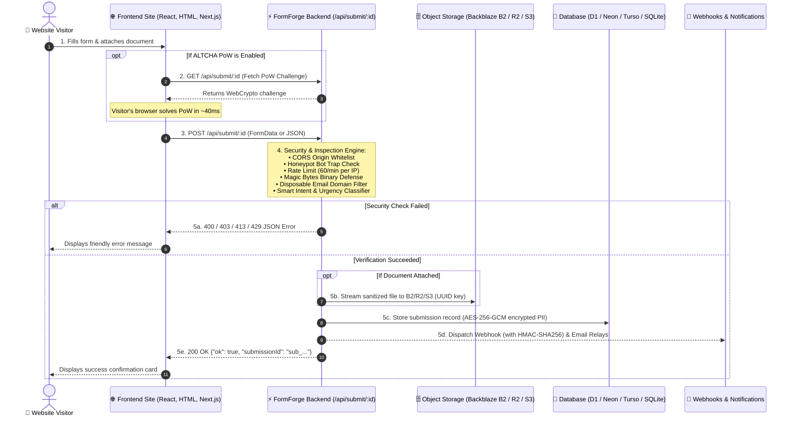

<h1 align="center">FormForge v1.0.0 Universal</h1>

<div align="center">
  A forever-free, open-source, universal form backend & analytics engine for static sites, modern web applications, and document intake pipelines.
  <br />
  <strong>Deploys on Cloudflare Workers/Pages, Vercel, Netlify, and Docker with 100% Zero-Card Free Tier support.</strong>
  <br />
  <strong>Developed with ❤️ by <a href="https://github.com/SudhirDevOps1">Sudhir Singh</a></strong>
  <br /><br />
  🔓 <em>No paid database required.</em> 📀 <em>Own your data.</em> ⚡️ <em>Zero-card forever free.</em>
  <br /><br />
  
  
  
  
  
</div>

<br />

<div align="center">
  
</div>

<br />

> 🚀 **v1.0.0 Universal Release Status:** Fully tested on Cloudflare Workers (`*.workers.dev`), Cloudflare Pages (`*.pages.dev`), Vercel, Netlify, and local development. FormForge is a feature-complete alternative to Formspree, Typeform, and Basin that runs entirely on free-tier infrastructure.

---

## ⚡ 1-Click Deploy to Cloudflare

Deploy your private serverless form backend in seconds directly to your Cloudflare account (100% within the free tier):

<div align="center">

[](https://deploy.workers.cloudflare.com/?url=https://github.com/SudhirDevOps1/FormForge)

</div>

### What Happens on Deploy:
1. Cloudflare forks this repository into your GitHub account.
2. Prompts you for your **Project Name**, **Database Name**, and a secure `AUTH_SECRET`.
3. Builds and provisions the Cloudflare Worker and D1 Database automatically.
4. You get a production URL (e.g., `https://formforge.YOUR-SUBDOMAIN.workers.dev/dashboard`) with zero credit card required!

---

## 📖 Essential Documentation & Guides

| 📂 Document | 📝 What You Will Find |
| :--- | :--- |
| [🤖 Ultimate AI & Integration Guide](./INTEGRATION_GUIDE.md) | **One-shot prompt for Cursor/ChatGPT/Claude** + 14 drop-in recipes (React, Next.js, Vue, Svelte, Astro, HTML, Webflow, WordPress, Shopify). |
| [🌟 Zero-Card Free Tier Mastery Guide](./docs/FREE_TIER_MASTERY_GUIDE.md) | Run 100% cardless across Vercel, Netlify, Cloudflare, Neon, Turso, GAS, and Backblaze B2. |
| [🛠️ Production Troubleshooting](./TROUBLESHOOTING.md) | Setup instructions, deployment loops, CORS resolution, and error codes. |
| [🔒 System Specifications & Limits](./limitation.md) | Architectural constraints, rate limits, storage quotas, and security boundaries. |
| [📋 Feature Status & Security Audit](./fixed.md) | Complete checklist, competitor comparison matrix, and 53/53 test score. |
| [📜 Changelog & Releases](./docs/CHANGELOG.md) | Chronological record of features, security enhancements, and version releases. |
| [🔐 Privacy Policy](./privacypolicy.html) | Zero-tracking, at-rest encryption, and GDPR/CCPA privacy commitments. |

---

## 🌟 2026 Modernization Suite & Key Features

### 1. 🎯 Smart Intent & Urgency Heuristic Triage
* **Zero-Cost, Privacy-First Classification:** Synchronously evaluates submission content and tone at ingestion time with 0 extra API calls and 0 cloud cost.
* **5 Actionable Categories:** Automatically tags submissions into:
  - 🚨 **Urgent:** Outages, production blockers, critical security incidents.
  - 💼 **Sales:** Quotes, demo requests, pricing, enterprise inquiries.
  - 🛠️ **Support:** Bug reports, troubleshooting, error inquiries.
  - 💡 **Feedback:** UX thoughts, feature suggestions, general improvements.
  - 💬 **General:** Contact messages and miscellaneous inquiries.
* **Instant Dashboard Filtering:** Color-coded badges and a reactive "All Intents" dropdown selector in the submissions toolbar.

### 2. 📡 Webhook Observability & HMAC Delivery Logs
* **Real-Time Delivery Auditing:** Dedicated `webhook_logs` table tracking target URL, event type, HTTP response code, error messages, and latency in milliseconds (`response_time_ms`).
* **HMAC SHA-256 Tamper-Proof Signatures:** Dispatches standard `X-FormForge-Signature: t={timestamp},v1={hmac}` headers alongside `X-FormForge-Delivery-Id` and `X-FormForge-Event`.
* **1-Click Redelivery:** Retry failed or timed-out webhooks directly from the dashboard Delivery Logs tab.
* **Receiver Snippets:** Pre-built signature verification code for Node.js and Python available directly in the dashboard.

### 3. 💬 Conversational Multi-Step Form Experience Mode
* **Typeform-Style Experience:** Switch between **Classic Single-Page** and **Conversational Step-by-Step** mode in Form Settings.
* **Hosted Standalone Page (`/f/[slug]`):** Renders one question at a time with smooth slide animations, top progress bar (`Step X of Y - Z% completed`), and responsive mobile layout.
* **Keyboard Navigation:** Press `Enter` to advance to the next question, `Ctrl+Enter` for textareas, and back buttons for revision.
* **Full Defense Support:** Integrates drag-and-drop document upload and ALTCHA proof-of-work challenges within the step flow.

### 4. ⚡ Real-Time Live Feed Ingestion Stream
* **Live Feed Active:** Background polling stream (every 25 seconds) checks for incoming submissions while preserving active search and filter states.
* **Glow Notification Banner:** Displays a pulsing `"⚡ New submission received just now!"` banner and smoothly prepends new entries to the table without page reloads.

### 5. 🔐 Native RFC 6238 TOTP Two-Factor Authentication (2FA)
* **Zero External Dependencies:** Built entirely with native WebCrypto (`crypto.subtle`) for constant-time HMAC-SHA1 verification across a \$\pm 1\$ 30-second time window.
* **Universal Authenticator Compatibility:** Generates standard `otpauth://totp/...` URIs compatible with Google Authenticator, Microsoft Authenticator, Authy, 1Password, and Bitwarden.
* **Hardened Login Flow:** Prompts for 6-digit TOTP code when MFA is enabled and supports secure disabling with current password or code.

### 6. 🗄️ Universal Multi-Database Engine
* **Cloudflare D1:** Default zero-card SQLite database built into Cloudflare Workers (500MB free storage, 5M reads/day, 100k writes/day).
* **Neon Serverless Postgres:** Connect via `POSTGRES_URL` or `NEON_DATABASE_URL` with autoscaling to zero.
* **Turso (libSQL):** Connect via `TURSO_DATABASE_URL` + `TURSO_AUTH_TOKEN`.
* **Local SQLite:** Instant local development via `better-sqlite3`.
* **Self-Healing Auto-Migrations (`autoMigrate`):** Automatically detects database dialect, generates missing tables, and applies column additions on startup with zero downtime.

### 7. 📁 Backblaze B2, Cloudflare R2 & AWS S3 Object Storage
* **10GB Free Permanent Storage:** Native integration with Backblaze B2 via AWS SigV4 (`B2_APPLICATION_KEY_ID`, `B2_APPLICATION_KEY`, `B2_BUCKET_NAME`, `B2_REGION`).
* **Cloudflare R2 & AWS S3:** Bind via Worker binding (`FILES_BUCKET`) or standard S3 credentials (`S3_ENDPOINT`, `S3_ACCESS_KEY_ID`, `S3_SECRET_ACCESS_KEY`).
* **Magic Bytes Anti-Malware Defense:** Zero-dependency binary signature verification scans initial byte patterns before uploading. Disguised executables (Windows PE `MZ`, Linux `ELF`, Unix `#!`, Java `CAFEBABE`) are permanently blocked even if renamed to `.png`, `.jpg`, or `.pdf`.
* **Stored XSS Neutralization:** Rejects HTML/SVG uploads containing `<script>` or malicious event handlers.
* **Live Connection Tester:** 1-click diagnostic probe in Dashboard Settings executes a non-destructive write/read/delete cycle and measures round-trip latency.

### 8. 🛡️ Native ALTCHA Proof-of-Work Anti-Spam (100% Free & Self-Hosted)
* **Zero Tracking Cookies:** Replaces Google reCAPTCHA and Cloudflare Turnstile with native in-browser cryptographic challenges computed in ~40ms on the visitor's device.
* **Single Endpoint Design:** The exact same endpoint handles both `GET` (PoW challenge) and `POST` (form submission).
* **100% GDPR/CCPA Compliant:** No third-party servers contacted, no tracking cookies stored, and no subscription limits.

### 9. 📊 Universal Analytics & Traffic Studio
* **Cross-Dialect Analytics:** Computes 30-day submission trends, verified clean counts, spam blocked, and peak traffic hours in UTC.
* **24-Hour Activity Heatmap:** Visualizes traffic distribution across all 24 hours of the day.
* **Device & Browser Breakdown:** Categorizes traffic into Desktop, Mobile, Tablet, and Bot, alongside Chrome, Safari, Firefox, and Edge.
* **In-Browser DuckDB SQL Studio:** Zero-cost WASM analytical engine executes SQL queries over local exports directly in the browser.

### 10. 💬 10+ Outbound Notification Relays
* **Google Apps Script (GAS):** 500–1,500 free emails/day via personal Gmail + live Google Sheets row logging (Zero card, ~50ms asynchronous HTTPS POST).
* **Telegram Bot:** Unlimited instant push alerts to mobile and desktop channels.
* **ntfy.sh:** Zero-account instant pub/sub topic notifications.
* **Direct Email APIs:** Resend, Brevo, SendGrid, Mailgun.
* **Custom SMTP Relays:** 10+ providers (Gmail, Outlook, Yahoo, Brevo, Mailjet, SMTP2GO) with AES-256-GCM encrypted passwords at rest.

---

## ⚡ System Architecture Flow



---

## 🔌 Quick Integration Examples

> 📖 **Full Multi-Framework Guide:** For complete, copy-paste components for **Next.js, React, Vue, Nuxt, Svelte, Astro, Webflow, WordPress, Shopify, Python, and cURL**, read [`INTEGRATION_GUIDE.md`](./INTEGRATION_GUIDE.md).

### Example 1: Modern HTML5 Form with File Upload & Honeypot

```html
<form 
  action="https://YOUR-WORKER.workers.dev/api/submit/YOUR_ENDPOINT_ID" 
  method="POST"
  enctype="multipart/form-data"
  style="max-width: 480px; display: flex; flex-direction: column; gap: 12px; font-family: sans-serif;"
>
  <input type="hidden" name="_next" value="https://yourwebsite.com/thank-you" />
  <input type="text" name="website" style="display:none;" tabindex="-1" autocomplete="off" aria-hidden="true" />

  <input name="name" type="text" required placeholder="Jane Doe" />
  <input name="email" type="email" required placeholder="jane@company.com" />
  <textarea name="message" rows="4" required placeholder="Your message..."></textarea>
  <input name="attachment" type="file" accept=".pdf,.png,.jpg,.jpeg,.docx" />

  <button type="submit" style="padding: 10px; background: #0284c7; color: white; border: none; border-radius: 8px; font-weight: bold; cursor: pointer;">
    Send Message ➔
  </button>
</form>
```

### Example 2: React / Next.js Component (`FormData` + TypeScript)

```tsx
"use client";

import { useState } from "react";

const ENDPOINT_URL = process.env.NEXT_PUBLIC_FORMFORGE_ENDPOINT || "https://YOUR-WORKER.workers.dev/api/submit/YOUR_ENDPOINT_ID";

export default function ContactForm() {
  const [submitting, setSubmitting] = useState(false);
  const [success, setSuccess] = useState(false);

  const handleSubmit = async (e: React.FormEvent<HTMLFormElement>) => {
    e.preventDefault();
    setSubmitting(true);
    const formData = new FormData(e.currentTarget);

    try {
      const res = await fetch(ENDPOINT_URL, { method: "POST", body: formData });
      const data = await res.json();
      if (res.ok && data.ok) setSuccess(true);
    } finally {
      setSubmitting(false);
    }
  };

  if (success) return <p className="text-emerald-400 font-bold">✓ Thank you! Message received.</p>;

  return (
    <form onSubmit={handleSubmit} className="flex flex-col gap-3 max-w-md">
      <input name="website" style={{ display: "none" }} tabIndex={-1} autoComplete="off" />
      <input name="name" required placeholder="Your Name" className="border p-2 rounded-lg" />
      <input name="email" type="email" required placeholder="Your Email" className="border p-2 rounded-lg" />
      <textarea name="message" required placeholder="Message" className="border p-2 rounded-lg" />
      <input name="attachment" type="file" accept=".pdf,.png,.jpg" className="text-sm" />
      <button type="submit" disabled={submitting} className="bg-sky-600 text-white font-bold p-2.5 rounded-lg">
        {submitting ? "Sending..." : "Submit Form"}
      </button>
    </form>
  );
}
```

### Example 3: 1-Line Floating Widget (`/widget.js`)

Drop this single line before `</body>` in Webflow, WordPress, Shopify, Squarespace, or static HTML:

```html
<script 
  src="https://YOUR-WORKER.workers.dev/widget.js" 
  data-endpoint="https://YOUR-WORKER.workers.dev/api/submit/YOUR_ENDPOINT_ID"
  data-title="Contact Us"
  data-color="#0284c7"
  defer
></script>
```

---

## ⚙️ Environment Variables Reference

### Core Configuration
| Variable | Required | Description |
| :--- | :--- | :--- |
| `AUTH_SECRET` | **Yes** | 32+ character random secret used for HMAC password hashing, API tokens, and sessions (`openssl rand -hex 32`). |
| `DB` | Yes (on CF) | Cloudflare D1 database binding name (configured in `wrangler.jsonc`). |
| `ALLOW_REGISTRATION` | No | Set to `false` after initial registration to enforce owner-only single-tenant mode. |

### Multi-Database Selection (Pick One)
| Variable | Engine | Description |
| :--- | :--- | :--- |
| *Default (None)* | Cloudflare D1 | Uses bound Cloudflare D1 SQLite database. |
| `POSTGRES_URL` / `NEON_DATABASE_URL` | Neon Postgres | Serverless PostgreSQL connection string (`postgresql://...`). |
| `TURSO_DATABASE_URL` + `TURSO_AUTH_TOKEN` | Turso (libSQL) | Serverless libSQL connection (`libsql://...`). |

### Object Storage (Backblaze B2, Cloudflare R2, AWS S3)
| Variable | Provider | Description |
| :--- | :--- | :--- |
| `B2_APPLICATION_KEY_ID` | Backblaze B2 | Backblaze Application Key ID (Recommended: 10GB free permanent storage). |
| `B2_APPLICATION_KEY` | Backblaze B2 | Backblaze Application Key secret. |
| `B2_BUCKET_NAME` | Backblaze B2 | B2 Bucket name. |
| `B2_REGION` | Backblaze B2 | Region (e.g. `us-west-004`, `eu-central-003`). |
| `R2_ACCESS_KEY_ID` + `R2_SECRET_ACCESS_KEY` + `R2_ACCOUNT_ID` + `R2_BUCKET_NAME` | Cloudflare R2 | S3-compatible credentials for Cloudflare R2. (Or bind as `FILES_BUCKET`). |
| `S3_ENDPOINT` + `S3_ACCESS_KEY_ID` + `S3_SECRET_ACCESS_KEY` + `S3_BUCKET_NAME` + `S3_REGION` | AWS S3 / MinIO | Standard S3 credentials for AWS, Wasabi, Storj, or self-hosted MinIO. |

### Email Notifications (Optional)
| Variable | Provider | Free Capacity |
| :--- | :--- | :--- |
| `RESEND_API_KEY` + `RESEND_FROM` | Resend API | 100 emails/day |
| `BREVO_API_KEY` + `BREVO_FROM` | Brevo API | 300 emails/day |
| `SENDGRID_API_KEY` + `SENDGRID_FROM` | SendGrid API | 100 emails/day |
| `MAILGUN_API_KEY` + `MAILGUN_DOMAIN` + `MAILGUN_FROM` | Mailgun API | 5,000 emails/month |
| `SMTP_ENABLED` + `SMTP_HOST` + `SMTP_PORT` + `SMTP_USER` + `SMTP_PASS` + `SMTP_FROM` | Custom SMTP | Universal SMTP relay across Gmail, Outlook, Brevo, Mailjet, etc. |

---

## 🔒 Security Posture & Verified Invariants (53/53 Tests Passed)

FormForge maintains strict security invariants validated on every commit and PR:

- **P1 — Cryptographic Invariants:** WebCrypto AES-256-GCM encryption with fresh IVs, constant-time HMAC-SHA256 comparison, PBKDF2 with 100,000 iterations, and memory zeroization.
- **P2 — Injection & XSS Defenses:** Strips `<script>`, malicious SVGs, event handlers, and dangerous protocols (`javascript:`, `data:`, `vbscript:`). Parameterized queries via Drizzle ORM — zero raw SQL.
- **P3 — Network & SSRF Defenses:** Blocks private IP ranges (`10.0.0.0/8`, `172.16.0.0/12`, `192.168.0.0/16`), localhost/loopback, cloud metadata IPs (`169.254.169.254`), and octal/hex obfuscation for all outbound webhooks.
- **P4 — Authentication & Abuse Defense:** Brute-force throttling (5 attempts / 15 min), disposable email domain filtering (100+ temporary providers blocked), and submission burst rate limiting (60/min per IP).
- **P5 — PII Privacy & CWE-209:** SHA-256 email pseudonyms, at-rest encryption for sensitive fields, path-traversal resistant storage keys, and generic sanitized public error envelopes.
- **P6 — Repository Hygiene:** Strict zero-warning ESLint, TypeScript `--noEmit`, and `HttpOnly; SameSite=Lax; Secure` session cookies.

---

## 🛠️ Local Development

```bash
# 1. Clone the repository
git clone https://github.com/SudhirDevOps1/FormForge.git
cd FormForge

# 2. Install dependencies
npm install

# 3. Create local environment file
cp .env.example .env.local

# 4. Run database migrations / initialization
npm run typecheck
npm test

# 5. Start local Next.js development server
npm run dev
```

Visit `http://localhost:3000/dashboard` to register your owner account and configure your first form.

---

## 📜 License

MIT License — © 2024-2026 [Sudhir Singh](https://github.com/SudhirDevOps1). All rights reserved.

You are free to self-host, modify, and redistribute FormForge under the terms of the MIT license. If you host or redistribute this application, please retain author attribution to **Sudhir Singh** and link back to [github.com/SudhirDevOps1/FormForge](https://github.com/SudhirDevOps1/FormForge).
