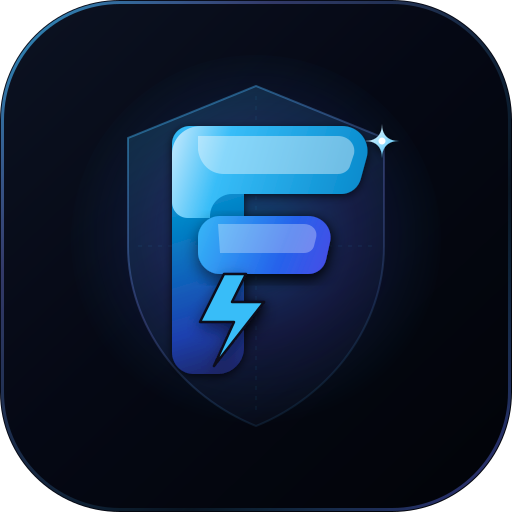

<h1 align="center">FormForge v2.2 Universal</h1>

<div align="center">
  A forever-free, open-source, universal form backend & analytics engine for static sites.
  <br />
  <strong>Deploys on Cloudflare Workers/Pages, Vercel, Netlify, and Docker with 100% Zero-Card Free Tier support.</strong>
  <br />
  <strong>Developed by <a href="https://github.com/SudhirDevOps1">Sudhir Singh</a></strong>
  <br /><br />
  🔓 <em>No paid database required.</em> 📀 <em>Own your data.</em> ⚡️ <em>Zero-card forever free.</em>
  <br /><br />
  
  
  
  
</div>

<br />

> 🚀 **v2.2 Universal Status:** Fully tested on Cloudflare Workers (`*.workers.dev`), Cloudflare Pages (`*.pages.dev`), Vercel, Netlify, and local development. Key capabilities include:
> - **In-Dashboard Interactive API Documentation & Live Sandbox Tester** (direct browser API testing with response time latency counter).
> - **100% Native In-App Confirmation Modals** (sleek dark glassmorphic dialogs replacing all browser alert popups).
> - **Submissions Lifecycle & Bulk Management** (per-row selection, floating bulk delete bar, and 1-click spam purging).
> - **D1 Storage Payload Optimization** (automatic transient token pruning reducing database row footprint by 40–60%).
> - **Universal Multi-Database Engine** (Cloudflare D1, Neon Serverless Postgres, Turso libSQL, SQLite with automatic schema migration).
> - **Cookie-Free ALTCHA Proof-of-Work Anti-Spam** (100% self-hosted WebCrypto PoW challenge and verification).
> - **Zero-Dependency Floating Embed Widget (`/widget.js`)** (drop-in vanilla JS popup for Webflow, WordPress, Shopify, and static HTML).
> - **In-Browser DuckDB Live SQL Query Studio** (instant WASM-powered analytics over local exports).
> - **Zero-Cost Notification Relays** (Google Apps Script Gmail+Sheets forwarder, Telegram Bot, ntfy.sh push, and custom SMTP with AES-256-GCM encryption).

<div align="center">
  
</div>

<br />

<div align="center">
  Perfect for <em>contact forms</em>, <em>feedback popups</em>, <em>waitlists</em>, <em>surveys</em>, <em>newsletter signups</em>, and <em>lead generation</em>.
</div>

<br />

<div align="center">

### 📖 Documentation & Guides

| 📂 File / Guide | 📝 Description |
| :--- | :--- |
| [🌟 Zero-Card Free Tier Mastery Guide](./docs/FREE_TIER_MASTERY_GUIDE.md) | Run 100% cardless on Vercel, Netlify, Cloudflare, Neon, Turso, GAS, B2. |
| [🛠️ Production Troubleshooting](./TROUBLESHOOTING.md) | Setup instructions, deployment loops, and error resolutions. |
| [🔒 System Limitations](./limitation.md) | Architectural constraints, IP rate limiting, and free-tier limits. |
| [🔧 Troubleshooting Notes](./troubleshooting1.md) | Additional debugging documentation and configuration details. |
| [📋 Feature Status & Security Audit](./fixed.md) | Full feature checklist, security score, and next-version roadmap. |
| [🛠️ Custom App/Game Integration](./INTEGRATION_GUIDE.md) | Connect HTML/JS static web games/apps, React apps, and configure CORS. |
| [🔐 Privacy Policy](./privacypolicy.html) | Data handling, encryption, and privacy commitments. |

</div>

<br />

---

## ⚡ Deploy to Cloudflare in Seconds

Deploy your own serverless form backend in seconds - as easy as signing up for a commercial service:

<div align="center">

[](https://deploy.workers.cloudflare.com/?url=https://github.com/SudhirDevOps1/FormForge)

</div>

### How Deploy to Cloudflare Works

Here's what happens when you click the button:

1. Cloudflare creates a copy of this repository in your GitHub account.
2. You provide configuration options:
   - **Project name** (e.g., "formforge")
   - **Database name** (e.g., "formforge-db")
   - **AUTH_SECRET** (Generate a strong secret key using [jwtsecrets.com](https://jwtsecrets.com) or `openssl rand -hex 32` to sign authentication sessions).
3. Cloudflare builds and deploys FormForge directly into **your own Cloudflare account** (fully within Cloudflare's free tier).
4. You get a unique URL (e.g., `https://formforge.YOUR-SUBDOMAIN.workers.dev/dashboard`) to access your dashboard.

> **💡 Note:** `RESEND_API_KEY` and `RESEND_FROM` are optional secrets. Leave them blank if you don't need email notifications.

---

## Why FormForge?

FormForge is inspired by simplicity, but upgraded for a modern Cloudflare-native stack:

- **No DATABASE_URL build failure** — no PostgreSQL pool is initialized at build time.
- **Cloudflare D1 by default** — free-tier friendly SQLite database built into Workers.
- **OpenNext Next.js app** — deploys to Cloudflare Workers with `@opennextjs/cloudflare`.
- **Privacy first** — data stays in the deployer’s Cloudflare account; IP addresses are hashed per form.
- **No artificial SaaS limits** — your limits are your Cloudflare plan and D1 quotas.
- **Export anytime** — CSV export endpoint prevents vendor lock-in.

---

## 🌟 Key Features

- **📖 In-Dashboard Interactive API Documentation Hub** — Dedicated sub-tab in *Connect & Snippets* with a **Live Endpoint Sandbox Tester** (measures latency in ms and inspects live JSON responses), detailed *When & Where to Use* architectural guides, and complete parameter references.
- **🛡️ 100% Native In-App Confirmation Modals** — Sleek dark glassmorphic dialogs for single/bulk deletions, form pausing, and API key revocation. Zero native browser `window.confirm` alert popups.
- **🗑️ Submissions Bulk Deletion & Spam Cleaner** — Multi-item selection with a floating bulk actions bar (`Delete Selected (X)`) and one-click "Clear All Spam" with database row count badges.
- **💾 D1 Storage Optimization & Payload Pruning** — Automatically strips transient verification fields (`altcha`, `honeypotField`, PoW challenge tokens) before writing to SQLite D1, reducing database storage footprint by 40–60%.
- **🌐 Multi-Platform Deployment** — Deploy on Cloudflare Workers (`*.workers.dev`), Cloudflare Pages (`*.pages.dev`), Vercel (`*.vercel.app`), Netlify (`*.netlify.app`), or self-hosted Docker.
- **🗄️ Universal Multi-Database Engine** — Native support for Cloudflare D1, Neon Serverless Postgres, Turso (libSQL), and local file SQLite with automatic zero-downtime startup migration (`autoMigrate`).
- **🦆 In-Browser DuckDB Live SQL Query Studio** — Interactive SQL analytical engine running inside the browser with zero server compute and zero database costs. Includes 1-click execution, DuckDB CLI commands, and MotherDuck queries.
- **💬 Zero-Dependency Floating Embed Widget (`/widget.js`)** — Ultra-lightweight (<3KB) vanilla JS popup feedback & contact modal. Embed on any Webflow, WordPress, Shopify, Framer, Wix, or static site with a single `<script>` tag.
- **⚡ Live Integration & Webhook Tester** — Test outgoing webhooks (with HMAC-SHA256 signatures), Google Apps Script relays, Telegram Bot alerts, and ntfy.sh mobile push in real time directly from the dashboard.
- **📨 100% Free Notification Relays** — Google Apps Script (500–1,500 free emails/day via Gmail + auto Google Sheets row logging), Telegram Bot push notifications, and ntfy.sh instant mobile alerts without third-party subscriptions.
- **🔐 6-Digit Cryptographic OTP Verification** — Zero-cost submitter email verification via secure 6-digit one-time passcodes.
- **📁 Universal S3 / Backblaze B2 File Uploads** — 10GB free permanent storage with Backblaze B2 or Cloudflare R2 compatibility.
- **🛡️ Enterprise Spam & Abuse Defenses** — ALTCHA Proof-of-Work (100% free, self-hosted, privacy-first), Honeypot bot traps, custom keyword blocklists, DNS MX validation, and timing-safe authentication.
- **📊 Multi-Format Data Exports** — Export submissions in CSV, JSON, and clean human-readable PDF/TXT reports.
- **🎨 Multi-Framework Code Generator** — Instant copy-paste snippets for Plain HTML, Floating Widget, React, Next.js, Vue, Svelte, Tailwind, Python Requests, and cURL across 5 aesthetic themes.
- **Real Dashboard** at `/dashboard` — Manage forms, inspect submissions, view analytics, and generate API keys.

---

## 🛡️ Advanced Security & Performance Architecture

FormForge includes advanced security mechanisms out-of-the-box that are typically behind paid enterprise tiers in commercial form backends:

### 1. 🛡️ ALTCHA Proof-of-Work Anti-Spam (100% Free & Self-Hosted)
FormForge replaces third-party CAPTCHAs with native ALTCHA Proof-of-Work protection. Submissions are verified via in-browser cryptographic challenges computed seamlessly by the visitor's device.
* **Benefits:** Zero third-party cookies, GDPR compliant, zero subscription fees, and no external API keys required.
* **Setup:** Toggle on in form settings, include the lightweight ALTCHA script on your site, and add the `<altcha-widget challengeurl="/api/submit/:endpointId">` element to your form.

### 2. ⚡ Google Apps Script (GAS) vs Direct SMTP
* **Why GAS / Webhooks are Recommended:**
  - Cloudflare Workers enforce strict execution time and socket concurrency limits. A standard SMTP handshake requires an 8-step conversational TCP roundtrip (`connect -> EHLO -> STARTTLS -> AUTH -> MAIL -> RCPT -> DATA -> QUIT`) taking 1.5–3.5s, which risks Worker timeouts (`Error 524`) during high traffic bursts.
  - Google Apps Script (GAS) runs over a single asynchronous HTTPS POST in **~50ms** using `ctx.waitUntil()`, resulting in zero Worker freeze, 500–1,500 free emails/day via your own Gmail, and automatic live Google Sheets logging!
* **SMTP Alternative:** FormForge still supports custom SMTP servers (Gmail App Passwords, Resend, Brevo, SendGrid, etc.) with passwords encrypted at rest via AES-256-GCM.

### 3. 📧 Custom Submitter Autoresponder
Automatically deliver structured, personalized emails to users immediately after they submit a form.
* **Dynamic Variables:** Draft your message template using `{curly_braces}` matching form fields (e.g. `Hi {name}, thank you for writing to us about {message}!`). The backend dynamically compiles and replaces these values on submission.

### 3. 🚫 Custom Spam Words Blocklist
Filter incoming payloads against a blacklist of forbidden keywords (e.g., `crypto`, `casino`, `free money`).
* **Enforcement:** Enter comma-separated keywords in the form's spam settings. Any submission containing these words in any field is flagged with `+100` spam score and blocked.

### 4. 🔑 API Key Expiration & Security
Generate secure API keys to read forms and submissions programmatically.
* **Safety:** Set expiration parameters (`30`, `90`, `365` days, or `Never`). The Cloudflare Worker validation layer rejects requests made using expired keys with `401 Unauthorized`.

### 5. 💬 10+ Auto-Formatting Webhooks
Delivers form notifications straight to your communications channels in rich visual styles:
* **Auto-format:** Paste your webhook URL. The backend automatically styles the payloads:
  * **Slack:** Rich formatting using Slack Blocks.
  * **Discord:** Beautiful color-bordered Discord Embed cards.
  * **Stoat.chat / Revolt:** Clean Markdown message content blocks.
  * **Microsoft Teams:** Office 365 Connector card format.
  * **Mattermost:** Structured Markdown headers and bullet lists.
  * **Generics (IFTTT, Zapier, Make, etc.):** Standard structured JSON payload is delivered.
* **Resilience:** Skip failures automatically so email notifications and DB writes are never blocked by a failing webhook.

### 6. 📧 Custom SMTP Server Integration (10+ Email Providers)
Configure custom SMTP credentials per form directly from the settings panel.
* **Gmail Auto-Config:** Entering a Gmail address auto-configures the host/port (`smtp.gmail.com:587`) and provides hints for setting up a 16-character Gmail App Password.
* **Supported Providers:** Gmail, Resend SMTP, Yahoo, Outlook, Mailjet, Brevo, SMTP2GO, SendGrid, Amazon SES, Mailgun, and Postmark.
* **🔒 AES-GCM Encrypted Passwords:** Passwords are fully encrypted in the D1 database and never sent to the client browser.
* **🧪 Test Settings Endpoint:** Includes a "Send test email" button to verify connection settings before saving.

### 6. 📅 Automatic Data Retention Purging
Automatically keep your Cloudflare D1 database storage usage clean and compliant by purging submissions older than a specific retention period.
* **Auto-Purge:** Set the retention limit per form (`30`, `60`, `90` days, or `Keep Forever`) in the General Settings. The backend automatically scans and deletes expired records for that form upon receiving new incoming submissions. Zero cron configuration is required.

### 7. ✉️ Submitter Email Verification (Double Opt-in)
Verify submitter email addresses before accepting submissions and dispatching webhook notifications.
* **Verification Flow:** Enable via form settings. When a submission is received, its status is set to `pending` and a unique verification link is sent to the submitter's email. Clicking the link updates the status to `accepted` and triggers webhook alerts.

---

## Tech Stack

- **Next.js 15.1.3 App Router** + **React 19**
- **Cloudflare Workers** via **OpenNext** (`@opennextjs/cloudflare`)
- **Cloudflare D1** using **Drizzle ORM** (`drizzle-orm/d1`)
- **Tailwind CSS**
- **Wrangler** for deploy and D1 migrations

---

## 🛠️ Manual Setup (Alternative)

If you prefer to set up manually instead of using the one-click button:

```bash
# 1. Clone & install
git clone https://github.com/SudhirDevOps1/FormForge.git
cd my-form
npm install

# 2. Login to Cloudflare
npx wrangler login

# 3. Auto setup (interactive — asks app name, db name, auth secret)
npm run setup

# OR do it manually:

# 3a. Create D1 database
npx wrangler d1 create formforge-db
# Copy the database_id and paste it in wrangler.jsonc

# 3b. Set AUTH_SECRET
npx wrangler secret put AUTH_SECRET
# Paste your generated secret

# 3c. Deploy
npm run deploy
```

---

## Environment Variables

### Required
| Variable | Description |
| --- | --- |
| `AUTH_SECRET` | Long random secret for HMAC session/API-key hashing. Generate with `openssl rand -hex 32`. |
| `DB` | Cloudflare D1 binding name. Configure as a D1 binding, not as a string secret. |

### Email Providers (Direct API — Pick One)
| Variable | Provider | Free Tier |
| --- | --- | --- |
| `RESEND_API_KEY` + `RESEND_FROM` | Resend | 100 emails/day |
| `BREVO_API_KEY` + `BREVO_FROM` | Brevo (Sendinblue) | 300 emails/day |
| `SENDGRID_API_KEY` + `SENDGRID_FROM` | SendGrid | 100 emails/day |
| `MAILGUN_API_KEY` + `MAILGUN_DOMAIN` + `MAILGUN_FROM` | Mailgun | 5,000/month |

### SMTP Relay (Universal — For MailerLite, Mailchimp, Mailjet, Mailtrap, Loops, Notifuse, etc.)
| Variable | Description |
| --- | --- |
| `SMTP_ENABLED` | Set to `true` to enable global SMTP. |
| `SMTP_HOST` | SMTP host (e.g. `smtp.gmail.com`). |
| `SMTP_PORT` | SMTP port (e.g. `587`). |
| `SMTP_USER` | SMTP username. |
| `SMTP_PASS` | SMTP password (use wrangler secret). |
| `SMTP_FROM` | Sender email address. |

### File Storage (S3-Compatible — Backblaze B2, Wasabi, Storj, AWS S3, MinIO, etc.)
| Variable | Description |
| --- | --- |
| `S3_ENDPOINT` | S3-compatible endpoint URL (e.g. `https://s3.us-west-002.backblazeb2.com`). |
| `S3_ACCESS_KEY_ID` | S3 access key (use wrangler secret). |
| `S3_SECRET_ACCESS_KEY` | S3 secret key (use wrangler secret). |
| `S3_BUCKET_NAME` | Bucket name for file uploads. |
| `S3_REGION` | Region (default: `us-east-1`). |

### Security & Registration
| Variable | Description |
| --- | --- |
| `ALLOW_REGISTRATION` | Set to `false` to disable new user registration (owner-only mode). |

> **Note:** Cloudflare R2 can also be used by binding an R2 bucket as `FILES_BUCKET` in `wrangler.jsonc`.
> Do **not** set `DATABASE_URL`. FormForge uses Cloudflare D1 by default.

---

## 🔌 Client App & Website Integration Guide

Connect any frontend website, mobile/web application, or static site to your FormForge backend in minutes.

### 📋 Core Integration Rules & Requirements

Before embedding your form, ensure your client setup adheres to these core backend rules:

| Rule | Requirement | Backend Behavior |
| :--- | :--- | :--- |
| **Unified Single Endpoint** | `https://YOUR-WORKER.workers.dev/api/submit/{endpointId}` | Handles both `POST` (submission) and `GET` (live ALTCHA PoW challenge) at the exact same URL. |
| **Allowed Origins (CORS)** | Configure in Dashboard ➔ Form Settings | In production, set to your exact domain (e.g. `https://mywebsite.com`). In dev/test, set to `*`. Unauthorized origins receive `403 Forbidden` (`ORIGIN_BLOCKED`). |
| **Email Field Validation** | Field name: `name="email"` (or `reply_to`) | If provided, must be syntactically valid (`user@domain.com`) AND pass live DNS MX record checks. Invalid emails or dead domains receive `400 Bad Request`. |
| **Honeypot Bot Trap** | Field name: `name="website"` (hidden) | Legitimate users leave it blank; spam bots fill it automatically. If filled, the submission receives `+100` spam score and is flagged as spam. |
| **Spam Blocklist** | Custom keywords in Form Settings | Any submission containing banned words (e.g. `casino, crypto`) is flagged as spam automatically. |
| **Payload Limit** | Max `64 KB` per submission | Payloads exceeding 64KB receive `413 PAYLOAD_TOO_LARGE`. |
| **Rate Limiting** | Max `60 requests / minute` per IP | Rapid submissions receive `429 RATE_LIMITED` with `Retry-After` header. |
| **ALTCHA Status** | Form Settings ➔ ALTCHA Toggle | If **ON**, client must submit an `altcha` PoW token. If **OFF**, forms submit instantly without any challenge. |

---

### 🚀 Ready-to-Use Code Templates

#### Template 1: Plain HTML Form (Zero JavaScript, Direct POST with Redirect)
> 💡 **Requirement:** In FormForge dashboard, make sure **ALTCHA Proof-of-Work** is toggled **OFF** for zero-JS forms.

```html
<form 
  action="https://YOUR-WORKER.workers.dev/api/submit/YOUR_ENDPOINT_ID" 
  method="POST"
  style="max-width: 480px; display: flex; flex-direction: column; gap: 12px; font-family: sans-serif;"
>
  <!-- Optional redirect: User goes here after submitting -->
  <input type="hidden" name="_next" value="https://mywebsite.com/thank-you.html" />

  <!-- Anti-Bot Honeypot Trap (Do not remove, keep hidden) -->
  <input type="text" name="website" style="display:none;" tabindex="-1" autocomplete="off" />

  <label for="name">Your Name</label>
  <input id="name" name="name" type="text" placeholder="John Doe" required />

  <label for="email">Email Address</label>
  <input id="email" name="email" type="email" placeholder="john@example.com" required />

  <label for="message">Message</label>
  <textarea id="message" name="message" rows="4" placeholder="How can we help?" required></textarea>

  <button type="submit" style="padding: 10px 16px; background: #2563eb; color: white; border: none; border-radius: 6px; cursor: pointer;">
    Send Message
  </button>
</form>
```

---

#### Template 2: Single-Endpoint HTML Form with ALTCHA Anti-Spam (100% Free & Self-Hosted)
> 🛡️ Both the cryptographic challenge (`GET`) and form submission (`POST`) use the **exact same endpoint URL**!  
> 💡 **Enterprise CSP Tip:** If your app enforces strict Content Security Policy (`script-src 'self'`), save `altcha.min.js` in your `public/` directory and load from `/altcha.min.js` without any external CDN dependencies.

```html
<!DOCTYPE html>
<html lang="en">
<head>
  <meta charset="UTF-8">
  <title>Contact Us</title>
  <!-- 1. Include the lightweight ALTCHA script (or load locally from /altcha.min.js) -->
  <script defer src="https://cdn.jsdelivr.net/npm/altcha/dist/altcha.min.js" type="module"></script>
</head>
<body>

  <form 
    action="https://YOUR-WORKER.workers.dev/api/submit/YOUR_ENDPOINT_ID" 
    method="POST"
    style="max-width: 480px; display: flex; flex-direction: column; gap: 12px; font-family: sans-serif;"
  >
    <input type="hidden" name="_next" value="https://mywebsite.com/thank-you" />
    <input type="text" name="website" style="display:none;" tabindex="-1" autocomplete="off" />

    <label for="name">Your Name</label>
    <input id="name" name="name" type="text" placeholder="John Doe" required />

    <label for="email">Email Address</label>
    <input id="email" name="email" type="email" placeholder="john@example.com" required />

    <label for="message">Message</label>
    <textarea id="message" name="message" rows="4" required></textarea>

    <!-- 2. ALTCHA PoW Widget: Uses auto="onload" for instant background solving and EXACT same FormForge endpoint! -->
    <altcha-widget 
      auto="onload"
      challengeurl="https://YOUR-WORKER.workers.dev/api/submit/YOUR_ENDPOINT_ID"
    ></altcha-widget>

    <button type="submit" style="padding: 10px 16px; background: #2563eb; color: white; border: none; border-radius: 6px; cursor: pointer;">
      Submit Form
    </button>
  </form>

</body>
</html>
```

---

#### Template 3: React / Next.js Component (`fetch` with JSON & Status Feedback)

```tsx
"use client";

import { useState } from "react";

const ENDPOINT_URL = "https://YOUR-WORKER.workers.dev/api/submit/YOUR_ENDPOINT_ID";

export default function ContactForm() {
  const [formData, setFormData] = useState({ name: "", email: "", message: "", website: "" });
  const [status, setStatus] = useState<"idle" | "submitting" | "success" | "error">("idle");
  const [errorMessage, setErrorMessage] = useState("");

  const handleSubmit = async (e: React.FormEvent) => {
    e.preventDefault();
    setStatus("submitting");
    setErrorMessage("");

    try {
      const res = await fetch(ENDPOINT_URL, {
        method: "POST",
        headers: { "Content-Type": "application/json" },
        body: JSON.stringify(formData),
      });

      const data = await res.json();

      if (!res.ok || !data.ok) {
        throw new Error(data.message || `Submission failed with status ${res.status}`);
      }

      setStatus("success");
      setFormData({ name: "", email: "", message: "", website: "" });
    } catch (err: any) {
      setStatus("error");
      setErrorMessage(err.message || "An unexpected error occurred. Please try again.");
    }
  };

  return (
    <form onSubmit={handleSubmit} style={{ maxWidth: 440, display: "flex", flexDirection: "column", gap: 12 }}>
      {/* Honeypot field (hidden from real users) */}
      <input 
        type="text" 
        name="website" 
        value={formData.website} 
        onChange={(e) => setFormData({ ...formData, website: e.target.value })} 
        style={{ display: "none" }} 
        tabIndex={-1} 
        autoComplete="off" 
      />

      <input
        type="text"
        placeholder="Your Name"
        value={formData.name}
        onChange={(e) => setFormData({ ...formData, name: e.target.value })}
        required
        disabled={status === "submitting"}
      />

      <input
        type="email"
        placeholder="Your Email"
        value={formData.email}
        onChange={(e) => setFormData({ ...formData, email: e.target.value })}
        required
        disabled={status === "submitting"}
      />

      <textarea
        rows={4}
        placeholder="Your Message..."
        value={formData.message}
        onChange={(e) => setFormData({ ...formData, message: e.target.value })}
        required
        disabled={status === "submitting"}
      />

      <button type="submit" disabled={status === "submitting"}>
        {status === "submitting" ? "Sending..." : "Send Message"}
      </button>

      {status === "success" && (
        <p style={{ color: "#16a34a", fontWeight: 500 }}>✓ Thank you! Your message has been received.</p>
      )}
      {status === "error" && (
        <p style={{ color: "#dc2626", fontWeight: 500 }}>✕ {errorMessage}</p>
      )}
    </form>
  );
}
```

---

#### Template 4: Vanilla JavaScript / AJAX (FormData with File Uploads)

```javascript
const form = document.querySelector("#contact-form");

form.addEventListener("submit", async (e) => {
  e.preventDefault();
  
  const submitBtn = form.querySelector('button[type="submit"]');
  submitBtn.disabled = true;
  submitBtn.textContent = "Sending...";

  const endpoint = "https://YOUR-WORKER.workers.dev/api/submit/YOUR_ENDPOINT_ID";
  const formData = new FormData(form);

  try {
    const res = await fetch(endpoint, {
      method: "POST",
      body: formData, // Automatically handles multipart/form-data & file attachments
    });

    const data = await res.json();

    if (res.ok && data.ok) {
      alert("✓ Message sent successfully! Reference ID: " + data.submissionId);
      form.reset();
    } else {
      alert("✕ Error: " + (data.message || "Failed to submit form."));
    }
  } catch (err) {
    alert("✕ Network or CORS error occurred: " + err.message);
  } finally {
    submitBtn.disabled = false;
    submitBtn.textContent = "Send Message";
  }
});
```

---

#### Template 5: 1-Line Floating Modal Widget (`/widget.js`)
Embed an interactive contact & feedback popup modal into Webflow, WordPress, Shopify, Framer, or any HTML page with zero build steps:

```html
<script 
  src="https://YOUR-WORKER.workers.dev/widget.js" 
  data-formforge-endpoint="https://YOUR-WORKER.workers.dev/api/submit/YOUR_ENDPOINT_ID"
  data-formforge-title="Get in Touch"
  data-formforge-primary-color="#2563eb"
  defer>
</script>
```

---

### 💻 Backend & CLI Submissions

#### cURL (Bash / Terminal)
```bash
curl -X POST https://YOUR-WORKER.workers.dev/api/submit/YOUR_ENDPOINT_ID \
  -H "Content-Type: application/json" \
  -d '{"name":"Alex","email":"alex@example.com","message":"Loving FormForge!"}'
```

#### Python (`requests`)
```python
import requests

url = "https://YOUR-WORKER.workers.dev/api/submit/YOUR_ENDPOINT_ID"
payload = {
    "name": "Alex",
    "email": "alex@example.com",
    "message": "Hello from Python backend"
}

response = requests.post(url, json=payload)
print(response.status_code, response.json())
```

---

## 📊 Free Tier Quota & Safe Operations Guide ($0/mo)

FormForge is architected to run completely **free of cost** on the Cloudflare Free Plan. Below is the detailed breakdown of daily capacity, data limits, and recommendations to ensure your application remains stable and safe indefinitely:

### ⚙️ Cloudflare Free Tier Specifications

| Service | Free Tier Limit | Daily Safe Budget | What it Represents |
| --- | --- | --- | --- |
| **Cloudflare Workers** | 100,000 requests / day | ~90,000 submissions + API hits | Daily form submissions, webhook hits, and dashboard API queries. |
| **D1 DB Storage** | 500 MB / account | Keep Forever or Purge | Storage space for user logins, forms metadata, and submissions database. |
| **D1 DB Reads** | 5,000,000 reads / day | ~4,500,000 queries | Reads occurring when viewing submission analytics and dashboards. |
| **D1 DB Writes** | 100,000 writes / day | ~90,000 inserts | Database insertions occurring when a user submits a form. |

### 📈 Monthly Data Capacity Calculation

* **Submission Size:** A typical submission payload takes roughly **500 bytes to 1 KB** of storage space.
* **Storage Capacity:** A 500 MB database can safely store **500,000 submissions** simultaneously!
* **Auto-Purge Strategy:** By setting a **Data Retention Limit** (e.g. 30, 60, or 90 days) in your settings:
  - FormForge automatically deletes expired submissions in the background during new incoming submissions.
  - This keeps your database footprint tiny (< 50MB) and ensures you never hit the 500MB storage ceiling.

### 📧 Free Email Sending Daily Budget

Depending on your configured email integration, your daily outbound email capacity is:
* **Global Resend API (Free):** Up to **100 emails/day** (3,000/month).
* **Gmail SMTP (Free via App Password):** Up to **500 emails/day** (recommended for portfolio forms).
* **Brevo SMTP (Free):** Up to **300 emails/day** (9,000/month).
* **Mailjet SMTP (Free):** Up to **200 emails/day** (6,000/month).
* **SMTP2GO SMTP (Free):** Up to **200 emails/day** (1,000/month).

### 💬 Webhook Delivery
* Webhooks (Slack, Discord, Stoat.chat, MS Teams, Mattermost) are **100% free and unlimited**. They are only restricted by your daily 100k Worker requests limit.

---

## Production Checklist

- ✅ The `database_id` in `wrangler.jsonc` is blank on purpose — Cloudflare creates the D1 database for you on first deploy.
- ✅ Set a strong `AUTH_SECRET` in Cloudflare secrets.
- ✅ FormForge self-heals its schema on first request, so no manual migration step is required (SQL migrations are included as a backup).
- ⚠️ Set `allowedOrigins` for each form instead of `*` when possible.
- ⚠️ Keep email/webhook integrations disabled unless needed.
- 📋 Open `/dashboard` after deploy to create an owner account, forms, and view submissions.
- 📋 Export submissions periodically if your compliance policy requires offline backups.

---

## Troubleshooting

### `Network error. Is the Worker deployed and D1 bound?`
This means the frontend cannot reach the API.
1. **Worker not deployed** — Click the deploy button above or run `npm run deploy`.
2. **D1 database not created** — The deploy button creates it automatically. For manual setup, run `npx wrangler d1 create formforge-db` and add the `database_id` to `wrangler.jsonc`.
3. **AUTH_SECRET not set** — Run `npx wrangler secret put AUTH_SECRET` and paste your secret.

### `Error: DATABASE_URL is required`
This means old PostgreSQL code is still being imported. FormForge removes `pg`, uses `drizzle-orm/d1`, and exposes `getDb()` so database access happens only inside request handlers.

### D1 binding not found
Confirm the binding name is exactly `DB` in `wrangler.jsonc` and in the Cloudflare dashboard.

---

## License

MIT — © 2024-2026 [Sudhir Singh](https://github.com/SudhirDevOps1). All rights reserved.

---

<div align="center">
  <strong>FormForge</strong> — Privacy-first serverless form backend<br />
  Developed with ❤️ by <a href="https://github.com/SudhirDevOps1">Sudhir Singh</a><br /><br />
  <a href="https://github.com/SudhirDevOps1/FormForge">⭐ Star on GitHub</a> · <a href="https://sudhirdevops1.github.io/FormForge/">📖 Documentation</a> · <a href="https://github.com/SudhirDevOps1/FormForge/issues">🐛 Report Bug</a>
</div>

> **© 2024-2026 Sudhir Singh. All rights reserved.**  
> You are free to self-host, modify, and redistribute FormForge under the MIT license.  
> If you host or redistribute this application, please credit **Sudhir Singh** and link to the original repository: [github.com/SudhirDevOps1/FormForge](https://github.com/SudhirDevOps1/FormForge).
